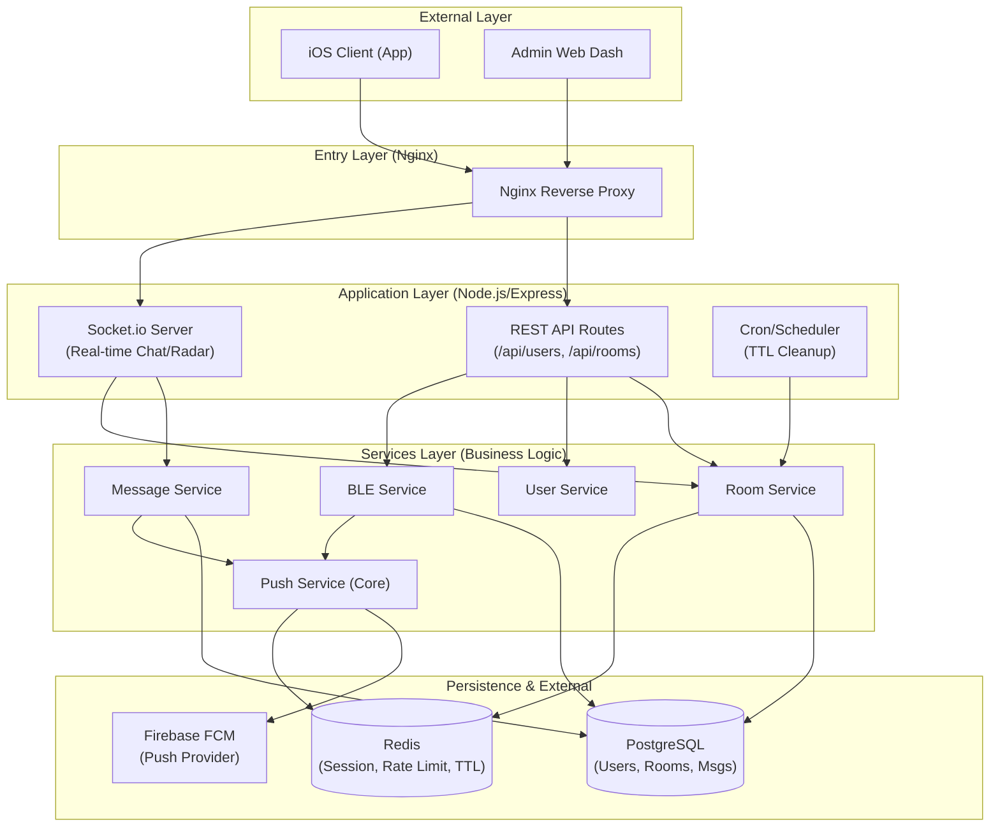
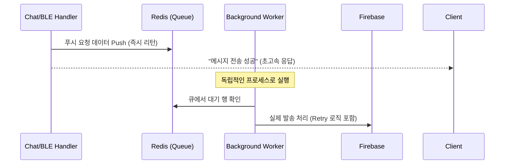

# YEO.PE Server Architecture Overview

이 문서는 서버의 기능별 레이어 구조와 모듈 간의 협력 방계를 시각화하고, 현재 구조의 한계 및 개선 방향을 설명합니다.

---

## 1. 아키텍처 레이어 다이어그램

---

## 2. 모듈별 "덩어리" 구분 (Chunks)

현재 서버는 크게 4가지 형태의 실행 동선을 가집니다:

1.  **API (HTTP)**: 계정 생성, 프로필 변경, 푸시 토큰 등록 등 명확한 요청-응답이 필요한 기능.
2.  **Socket (Real-time)**: 채팅 메시지 송수신, 유저 간 실시간 인터랙션.
3.  **Cleanup (Periodic Batch)**: `ttlService.js`에 의해 매 시간/분 단위로 만료된 방과 메시지를 삭제하는 주기적 작업.
4.  **Push Notification**: 실시간으로 발생하는 이벤트(새 메시지, 근처 유저 발견)를 Firebase에 전달하는 발송 엔진.

---

## 3. 푸시 서비스 구조 검토 (Fragmentation 및 효율성)

### 🧐 사용자의 우려사항 확인: "푸시 발송 모듈이 분리되어 운영되고 있지 않은 것 같다"
- **분석 결과**: 사용자의 우려가 **정확합니다**.
- **현재 구조**: `pushService.js`가 발송 핵심 로직은 모아두고 있지만, **"누가 발송할 것인가"**를 결정하는 로직은 `messageHandler.js`, `bleService.js`, `rooms.js` 등에 파편화되어 있습니다.
- **작동 방식**: 이벤트가 발생하자마자 API/Socket 핸들러 내부에서 직접 `pushService.send()`를 호출(Direct Call)합니다.

### ⚠️ 현재 구조의 문제점 (Non-Reasonable)
1.  **강한 결합(High Coupling)**: 채팅 로직이나 BLE 로직이 푸시 발송의 성공/실패 여부에 영향을 받을 수 있습니다.
2.  **안정성 부족**: Firebase 서버가 일시적으로 느려지거나 응답이 지연되면, 전체 API나 소켓 응답 속도가 같이 느려집니다.
3.  **확장성 한계**: 푸시 발송량이 수천 건으로 늘어날 경우, 단일 서버 프로세스에서 발송 부하를 모두 감당해야 하므로 서버가 멈출 수 있습니다.

### 🚀 향후 제안 모델: "발송 엔진의 완전 분리 (Worker Queue)"
향후 안정적인 운영을 위해서는 **메시지 큐(Message Queue)** 도입을 권장합니다.

- **합리적 구조**: 실시간 API는 오직 **"전송 요청"**만 큐에 던지고 바로 응답을 마칩니다. 실제 발송은 백그라운드 워커가 담당하므로, 푸시 서버의 장애가 서비스 전체 장애로 번지지 않습니다.

---

## 4. 결론 및 검토 의견

현재 구조는 MVP(Minimum Viable Product) 단계로서는 **작동 가능하고 단순**합니다. 하지만:
- **푸시 서비스의 안정성**을 위해서는 현재의 "Direct Call" 방식을 탈피하여 **"Job Queue(예: Redis Bull)"** 기반으로 분리하는 리팩토링이 필요해 보입니다.
- 초기 복구/이전 가이드를 통해 정리된 마이그레이션 기반은 합리적이나, 수동 개입을 줄이기 위한 고도화가 추천됩니다.
