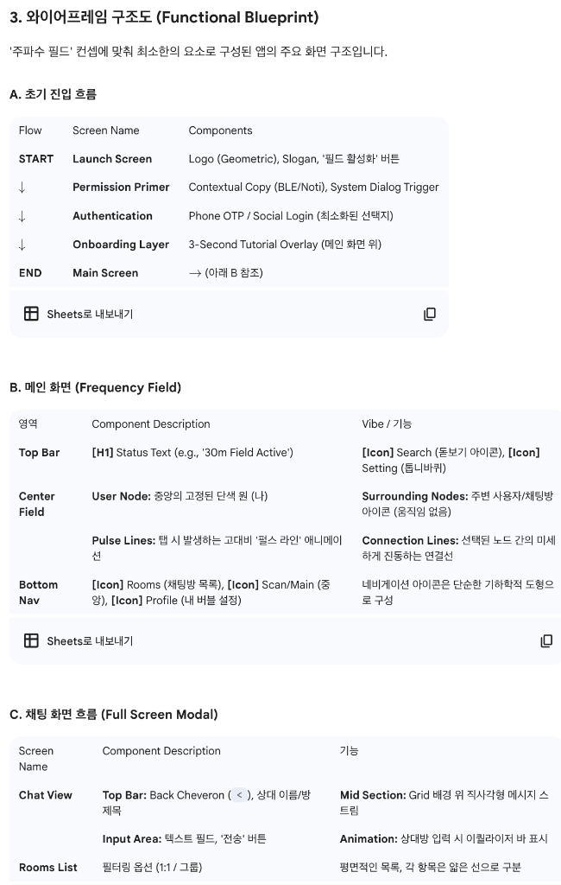
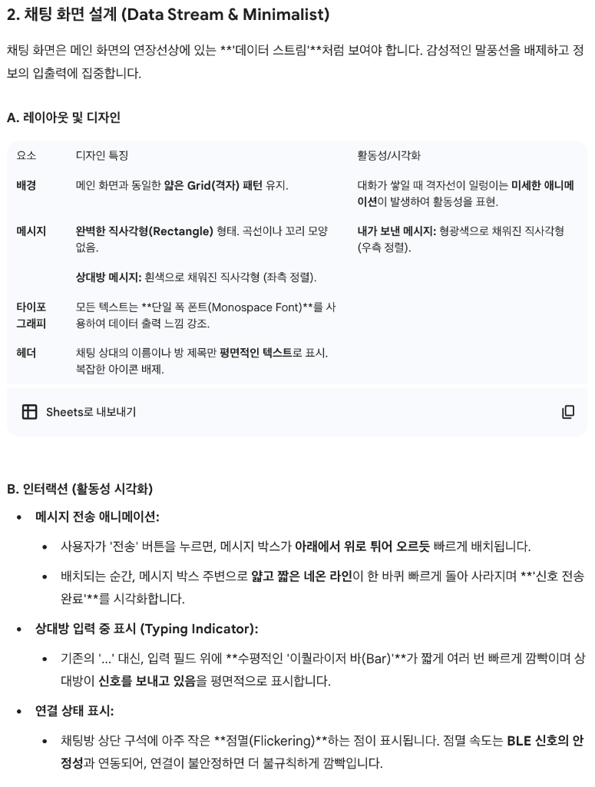

# 컨셉 4: 주파수 필드 (The Frequency Field)

이 컨셉은 앱을 **'주변 공간의 신호를 분석하는 미니멀한 측정 도구'**처럼 느끼게 합니다. 모든 디자인 요소를 평면적이고 기하학적으로 단순화하여 명료함을 극대화합니다.

## 1. 시각적 메타포: 주파수 분석 & 설계 도면

*   **메타포**: 고대비(High-Contrast)의 평면 Grid(격자) 필드 위에서 신호가 선명하게 움직이는 모습. 마치 건축 설계 도면이나 이퀄라이저처럼 보입니다.
*   **스타일**: 블랙/화이트 또는 짙은 네이비/네온 그린 등 2가지 색상만 사용한 고대비 디자인. 3D 효과나 질감(Texture)은 완전히 배제합니다.

## 2. 메인 화면 레이아웃: 평면 격자 필드

*   **배경**: 짙은 단색 배경 위에 아주 얇고 일정한 그리드(격자) 선이 깔려 있습니다.
*   **나 (중심)**: 화면 정중앙에 완벽한 단색의 원 또는 정사각형으로 표시됩니다. 내부에는 아바타나 이니셜이 심플하게 들어갑니다. 움직임이 없는 기준점입니다.
*   **주변 사용자 및 방**: 근처의 사용자나 활성화된 채팅방은 크기가 동일한 **작은 기호(Symbol)**나 단순 아이콘으로 표시됩니다.
*   **거리 시각화**: 30m 반경 내에서 BLE 신호 세기에 따라 필드 상에서 위치가 미세하게 조정되거나, 혹은 아이콘 주변의 테두리 굵기만 변화합니다.

## 3. 활동성 시각화 및 인터랙션

활동성을 강조하기 위해 **움직이는 '선(Line)'**을 적극적으로 활용합니다.

### 인터랙션

| UX 액션 | UI 반응 (활동성 강조) |
| :--- | :--- |
| **탐색 (Discovery)** | 메인 화면을 처음 실행하거나, 스캔 버튼을 탭합니다. 중앙의 '나'로부터 주변의 모든 아이콘으로 **아주 빠르고 명료한 '펄스 라인(Pulse Line)'**이 한 번 튀어나갔다가 즉시 사라집니다. (평면 이퀄라이저 바처럼 움직입니다.) |
| **선택 (Selection)** | 관심 있는 주변 사용자 아이콘을 탭합니다. 해당 아이콘과 중앙의 '나'를 잇는 **얇고 단단한 '연결선'**이 즉시 그려집니다. 이 선은 아주 미세하게 **진동(Vibrate)**하여 신호 연결 상태를 나타냅니다. |
| **방 입장 (Room Entry)** | 채팅방 아이콘을 탭합니다. 필드 전체의 격자 선들이 순간적으로 방의 색상으로 변하며 줌인됩니다. 배경의 격자가 그대로 채팅방의 기본 레이아웃이 됩니다. |
| **프로필 보기** | 연결선을 따라 그려지는 아이콘을 탭합니다. 프로필 정보가 **배경 위에 평면적인 '레이어(Layer)'**처럼 깔끔하게 띄워집니다. 절대 튀어 나오거나 3D로 뒤집히지 않습니다. |

## 4. 참고 자료

### 와이어프레임 구조도

### 채팅 화면 설계

