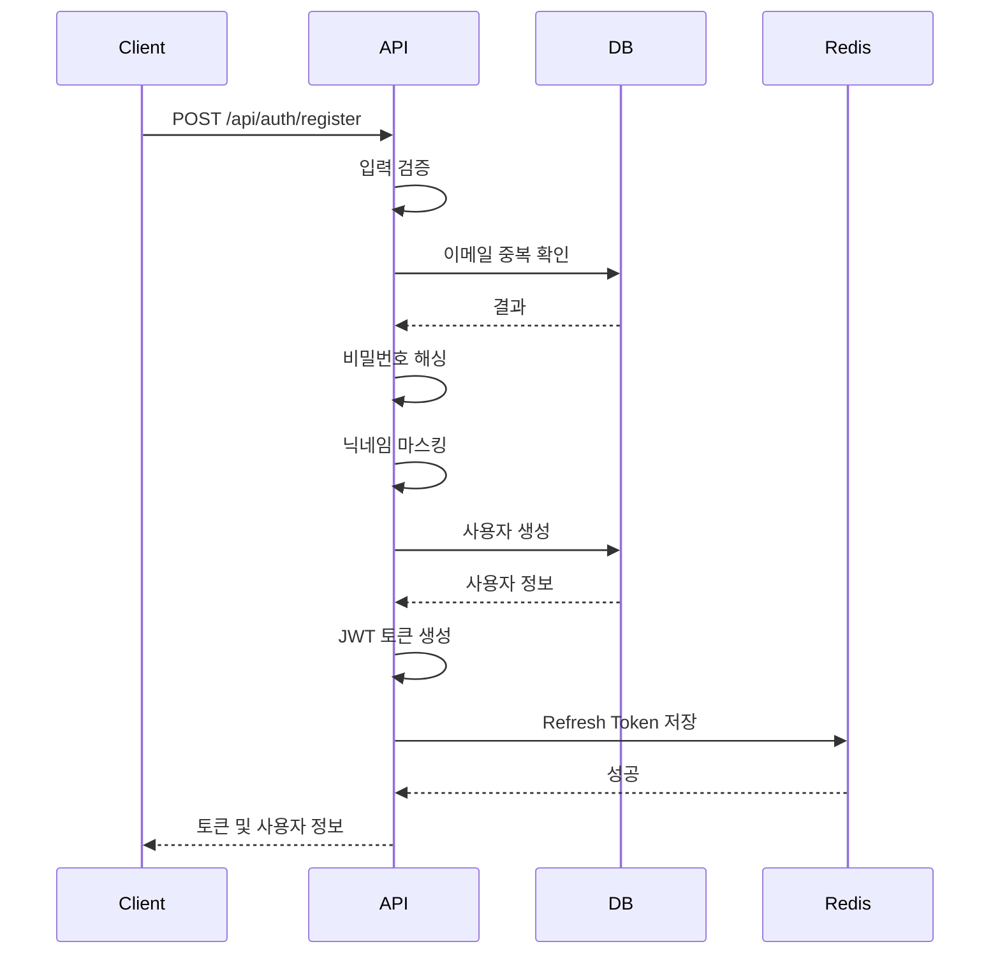
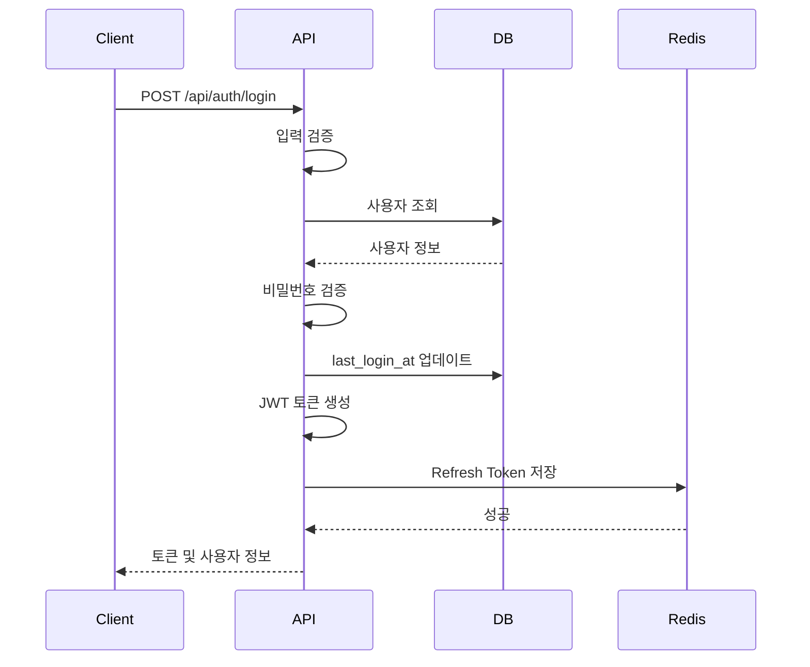
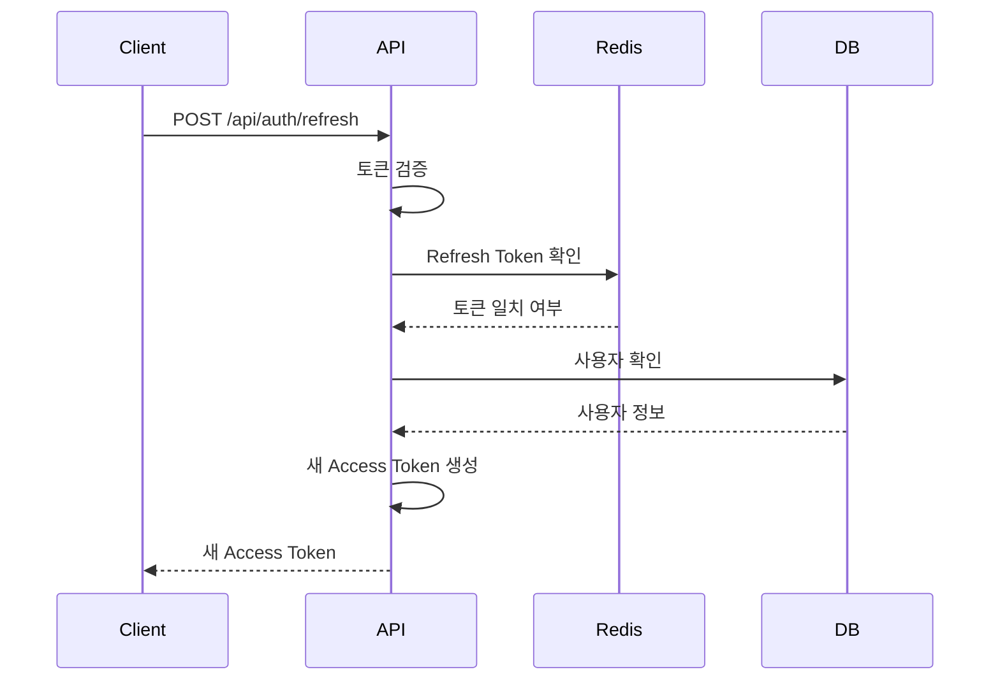
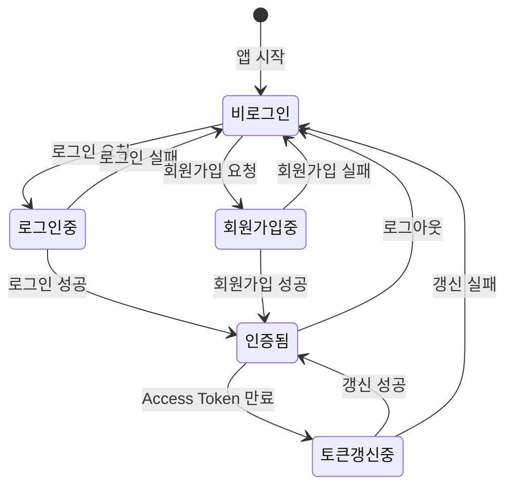

# 사용자 인증 (Authentication)

## 기능 개요

사용자 인증 시스템은 YEO.PE 서비스의 핵심 보안 기능입니다. 이메일 기반 회원가입/로그인을 제공하며, JWT 토큰을 사용한 stateless 인증 방식을 채택합니다.

### 목적

- 사용자 계정 생성 및 관리
- 안전한 인증 및 인가
- 세션 관리 (JWT 기반)
- 토큰 갱신 메커니즘

### 우선순위

**높음** - MVP 핵심 기능

---

## 전제 조건

### 회원가입

- 이메일 주소 (유효한 형식)
- 비밀번호 (8자 이상, 영문+숫자 조합 권장)
- 닉네임 (2-20자)

### 로그인

- 등록된 이메일 주소
- 올바른 비밀번호

### 토큰 갱신

- 유효한 Refresh Token

---

## 기능별 상세 명세

### 1. 회원가입 (Register)

#### 기능 설명

사용자가 이메일, 비밀번호, 닉네임을 입력하여 새 계정을 생성합니다.

#### API 명세

**엔드포인트**: `POST /api/auth/register`

**인증**: 불필요

**Rate Limit**: 5회/분

**요청 본문**:
```json
{
  "email": "user@example.com",
  "password": "password123",
  "nickname": "사용자닉네임"
}
```

**응답** (201 Created):
```json
{
  "token": "eyJhbGciOiJIUzI1NiIsInR5cCI6IkpXVCJ9...",
  "refreshToken": "eyJhbGciOiJIUzI1NiIsInR5cCI6IkpXVCJ9...",
  "user": {
    "id": "550e8400-e29b-41d4-a716-446655440000",
    "email": "user@example.com",
    "nickname": "사용자닉네임",
    "nicknameMask": "사용**"
  }
}
```

#### 동작 방식

1. **입력 검증**
   - 이메일, 비밀번호, 닉네임 필수 확인
   - 이메일 형식 검증 (정규식: `/^[^\s@]+@[^\s@]+\.[^\s@]+$/`)
   - 비밀번호 길이 검증 (최소 8자)
   - 닉네임 길이 검증 (2-20자)

2. **중복 확인**
   - 이메일 중복 확인 (데이터베이스 조회)

3. **비밀번호 해싱**
   - bcrypt를 사용하여 비밀번호 해싱 (salt rounds: 10)

4. **닉네임 마스킹**
   - 첫 글자만 보이고 나머지는 `*`로 마스킹
   - 예: "김철수" → "김**"

5. **사용자 생성**
   - PostgreSQL에 사용자 정보 저장
   - `auth_provider`: "email"
   - `settings`: 기본값 `{"bleVisible": true, "pushEnabled": true}`

6. **토큰 생성**
   - Access Token 생성 (만료: 7일)
   - Refresh Token 생성 (만료: 30일)
   - Refresh Token을 Redis에 저장 (TTL: 30일)

7. **응답 반환**
   - 토큰 및 사용자 정보 반환

#### 예외 처리

| 에러 코드 | 상황 | 응답 메시지 |
|----------|------|------------|
| 400 | 필수 필드 누락 | "이메일, 비밀번호, 닉네임을 모두 입력해주세요" |
| 400 | 비밀번호 길이 부족 | "비밀번호는 8자 이상이어야 합니다" |
| 400 | 닉네임 길이 오류 | "닉네임은 2자 이상 20자 이하여야 합니다" |
| 400 | 이메일 형식 오류 | "올바른 이메일 형식이 아닙니다" |
| 409 | 이메일 중복 | "이미 사용 중인 이메일입니다" |
| 429 | Rate Limit 초과 | "너무 많은 요청입니다. 잠시 후 다시 시도해주세요" |

#### UI/UX 플로우

```
[회원가입 화면]
  ↓
[이메일, 비밀번호, 닉네임 입력]
  ↓
[회원가입 버튼 클릭]
  ↓
[로딩 표시]
  ↓
[성공] → [자동 로그인] → [메인 화면]
[실패] → [에러 메시지 표시] → [재입력]
```

#### 테스트 케이스

**성공 시나리오**:
1. 유효한 이메일, 비밀번호(8자 이상), 닉네임(2-20자) 입력
2. 중복되지 않은 이메일 사용
3. 정상적으로 토큰 및 사용자 정보 반환

**실패 시나리오**:
1. 필수 필드 누락 → 400 에러
2. 이메일 형식 오류 → 400 에러
3. 비밀번호 8자 미만 → 400 에러
4. 닉네임 2자 미만 또는 20자 초과 → 400 에러
5. 중복된 이메일 → 409 에러
6. Rate Limit 초과 → 429 에러

---
151: 
152: ### 1.5. 소셜 로그인 (Social Login)
153: 
154: #### 기능 설명
155: 
156: Google, Apple, Kakao, Naver 계정을 사용하여 로그인 또는 회원가입을 진행합니다.
157: 
158: #### API 명세
159: 
160: **엔드포인트**: `POST /api/auth/social/:provider`
161: 
162: **Provider**: `google`, `apple`, `kakao`, `naver`
163: 
164: **요청 본문**:
165: ```json
166: {
167:   "token": "OAUTH_ACCESS_TOKEN_OR_ID_TOKEN"
168: }
169: ```
170: 
171: **응답** (200 OK):
172: ```json
173: {
174:   "token": "eyJhbGciOiJIUzI1NiIsInR5cCI6IkpXVCJ9...",
175:   "refreshToken": "eyJhbGciOiJIUzI1NiIsInR5cCI6IkpXVCJ9...",
176:   "user": {
177:     "id": "...",
178:     "email": "user@example.com",
179:     "nickname": "사용자닉네임",
180:     "authProvider": "google"
181:   },
182:   "isNewUser": false
183: }
184: ```
185: 
186: ---

### 2. 로그인 (Login)

#### 기능 설명

등록된 이메일과 비밀번호로 사용자를 인증하고 토큰을 발급합니다.

#### API 명세

**엔드포인트**: `POST /api/auth/login`

**인증**: 불필요

**Rate Limit**: 5회/분

**요청 본문**:
```json
{
  "email": "user@example.com",
  "password": "password123"
}
```

**응답** (200 OK):
```json
{
  "token": "eyJhbGciOiJIUzI1NiIsInR5cCI6IkpXVCJ9...",
  "refreshToken": "eyJhbGciOiJIUzI1NiIsInR5cCI6IkpXVCJ9...",
  "user": {
    "id": "550e8400-e29b-41d4-a716-446655440000",
    "email": "user@example.com",
    "nickname": "사용자닉네임",
    "nicknameMask": "사용**"
  }
}
```

#### 동작 방식

1. **입력 검증**
   - 이메일, 비밀번호 필수 확인

2. **사용자 조회**
   - 이메일로 사용자 조회

3. **비밀번호 검증**
   - bcrypt로 저장된 해시와 비교
   - 이메일 로그인 가능한 계정인지 확인 (`password_hash` 존재 여부)

4. **마지막 로그인 시간 업데이트**
   - `last_login_at` 필드 업데이트

5. **토큰 생성**
   - Access Token 생성 (만료: 7일)
   - Refresh Token 생성 (만료: 30일)
   - Refresh Token을 Redis에 저장 (TTL: 30일)

6. **응답 반환**
   - 토큰 및 사용자 정보 반환

#### 예외 처리

| 에러 코드 | 상황 | 응답 메시지 |
|----------|------|------------|
| 400 | 필수 필드 누락 | "이메일과 비밀번호를 입력해주세요" |
| 400 | 사용자 없음 | "이메일 또는 비밀번호가 올바르지 않습니다" |
| 400 | 비밀번호 불일치 | "이메일 또는 비밀번호가 올바르지 않습니다" |
| 400 | 이메일 로그인 불가 | "이메일 로그인을 사용할 수 없는 계정입니다" |
| 429 | Rate Limit 초과 | "너무 많은 요청입니다. 잠시 후 다시 시도해주세요" |

#### UI/UX 플로우

```
[로그인 화면]
  ↓
[이메일, 비밀번호 입력]
  ↓
[로그인 버튼 클릭]
  ↓
[로딩 표시]
  ↓
[성공] → [토큰 저장] → [메인 화면]
[실패] → [에러 메시지 표시] → [재입력]
```

#### 테스트 케이스

**성공 시나리오**:
1. 등록된 이메일과 올바른 비밀번호 입력
2. 정상적으로 토큰 및 사용자 정보 반환

**실패 시나리오**:
1. 필수 필드 누락 → 400 에러
2. 존재하지 않는 이메일 → 400 에러 (보안상 구체적 메시지 X)
3. 잘못된 비밀번호 → 400 에러 (보안상 구체적 메시지 X)
4. 소셜 로그인 계정 (비밀번호 없음) → 400 에러
5. Rate Limit 초과 → 429 에러

---

### 3. 로그아웃 (Logout)

#### 기능 설명

사용자의 Refresh Token을 삭제하여 로그아웃을 처리합니다.

#### API 명세

**엔드포인트**: `POST /api/auth/logout`

**인증**: 필요 (Access Token)

**요청 헤더**:
```
Authorization: Bearer {access_token}
```

**응답** (200 OK):
```json
{
  "message": "로그아웃되었습니다"
}
```

#### 동작 방식

1. **토큰 검증**
   - Access Token에서 사용자 ID 추출

2. **Refresh Token 삭제**
   - Redis에서 `refresh_token:{userId}` 키 삭제

3. **응답 반환**
   - 성공 메시지 반환

#### 예외 처리

| 에러 코드 | 상황 | 응답 메시지 |
|----------|------|------------|
| 401 | 토큰 없음/만료 | "인증이 필요합니다" |

#### UI/UX 플로우

```
[설정 화면]
  ↓
[로그아웃 버튼 클릭]
  ↓
[확인 다이얼로그]
  ↓
[확인] → [API 호출] → [토큰 삭제] → [로그인 화면]
```

#### 테스트 케이스

**성공 시나리오**:
1. 유효한 Access Token으로 로그아웃 요청
2. Refresh Token이 Redis에서 삭제됨
3. 성공 메시지 반환

**실패 시나리오**:
1. 토큰 없음 → 401 에러
2. 만료된 토큰 → 401 에러

---

### 4. 토큰 갱신 (Refresh Token)

#### 기능 설명

만료된 Access Token을 Refresh Token을 사용하여 갱신합니다.

#### API 명세

**엔드포인트**: `POST /api/auth/refresh`

**인증**: 불필요 (Refresh Token 필요)

**요청 본문**:
```json
{
  "refreshToken": "eyJhbGciOiJIUzI1NiIsInR5cCI6IkpXVCJ9..."
}
```

**응답** (200 OK):
```json
{
  "token": "eyJhbGciOiJIUzI1NiIsInR5cCI6IkpXVCJ9..."
}
```

#### 동작 방식

1. **입력 검증**
   - Refresh Token 필수 확인

2. **토큰 검증**
   - JWT 서명 및 만료 시간 검증
   - 토큰 타입이 "refresh"인지 확인

3. **Redis 확인**
   - Redis에서 저장된 Refresh Token과 일치하는지 확인

4. **사용자 확인**
   - 사용자가 존재하고 활성 상태인지 확인

5. **새 Access Token 생성**
   - 새로운 Access Token 생성 (만료: 7일)

6. **응답 반환**
   - 새 Access Token 반환

#### 예외 처리

| 에러 코드 | 상황 | 응답 메시지 |
|----------|------|------------|
| 400 | Refresh Token 없음 | "Refresh Token이 필요합니다" |
| 400 | 유효하지 않은 토큰 | "유효하지 않은 Refresh Token입니다" |
| 400 | 토큰 타입 오류 | "유효하지 않은 Refresh Token입니다" |
| 400 | 사용자 없음 | "사용자를 찾을 수 없습니다" |

#### UI/UX 플로우

```
[Access Token 만료 감지]
  ↓
[자동으로 Refresh Token으로 갱신 시도]
  ↓
[성공] → [새 Access Token 저장] → [원래 요청 재시도]
[실패] → [로그인 화면으로 이동]
```

#### 테스트 케이스

**성공 시나리오**:
1. 유효한 Refresh Token으로 갱신 요청
2. 새 Access Token 반환

**실패 시나리오**:
1. Refresh Token 없음 → 400 에러
2. 만료된 Refresh Token → 400 에러
3. Redis에 없는 Refresh Token → 400 에러
4. 토큰 타입이 "refresh"가 아님 → 400 에러
5. 사용자가 존재하지 않음 → 400 에러

---

### 5. 현재 사용자 정보 조회 (Get Me)

#### 기능 설명

현재 로그인한 사용자의 정보를 조회합니다.

#### API 명세

**엔드포인트**: `GET /api/auth/me`

**인증**: 필요 (Access Token)

**요청 헤더**:
```
Authorization: Bearer {access_token}
```

**응답** (200 OK):
```json
{
  "user": {
    "id": "550e8400-e29b-41d4-a716-446655440000",
    "email": "user@example.com",
    "nickname": "사용자닉네임",
    "nicknameMask": "사용**",
    "settings": {
      "bleVisible": true,
      "pushEnabled": true
    },
    "createdAt": "2024-01-01T00:00:00.000Z",
    "lastLoginAt": "2024-01-02T00:00:00.000Z"
  }
}
```

#### 동작 방식

1. **토큰 검증**
   - Access Token에서 사용자 ID 추출

2. **사용자 정보 조회**
   - 데이터베이스에서 사용자 정보 조회 (비밀번호 제외)

3. **응답 반환**
   - 사용자 정보 반환

#### 예외 처리

| 에러 코드 | 상황 | 응답 메시지 |
|----------|------|------------|
| 401 | 토큰 없음/만료 | "인증이 필요합니다" |
| 404 | 사용자 없음 | "사용자를 찾을 수 없습니다" |

---

## 시퀀스 다이어그램

### 회원가입 플로우



### 로그인 플로우



### 토큰 갱신 플로우



---

## 상태 다이어그램

### 인증 상태 전이



---

## 보안 고려사항

### 비밀번호 보안

- **해싱**: bcrypt 사용 (salt rounds: 10)
- **저장**: 평문 비밀번호는 절대 저장하지 않음
- **전송**: HTTPS를 통한 전송 필수

### 토큰 보안

- **Access Token**: 짧은 만료 시간 (7일)
- **Refresh Token**: 긴 만료 시간 (30일), Redis에 저장
- **토큰 검증**: 모든 보호된 엔드포인트에서 검증
- **토큰 저장**: 클라이언트 측 안전한 저장소 사용 권장

### Rate Limiting

- **인증 API**: 5회/분
- **목적**: 무차별 대입 공격 방지

### 에러 메시지

- **보안**: 구체적인 에러 메시지 지양 (예: "이메일 또는 비밀번호가 올바르지 않습니다")
- **목적**: 계정 존재 여부 추측 방지

---

## 참고 자료

- [JWT 인증 설정](../server/src/config/auth.js)
- [사용자 서비스](../server/src/services/userService.js)
- [인증 라우트](../server/src/routes/auth.js)
- [인증 미들웨어](../server/src/middleware/auth.js)


