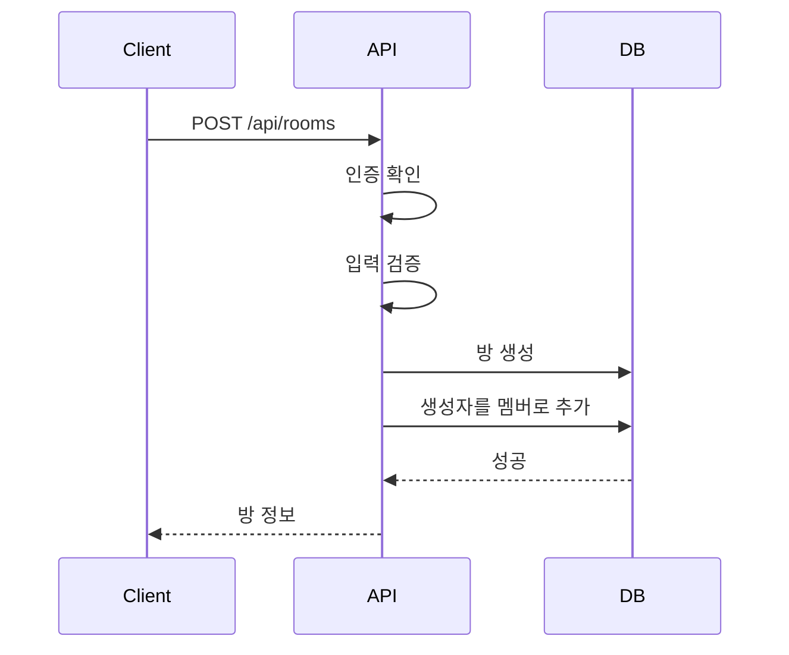
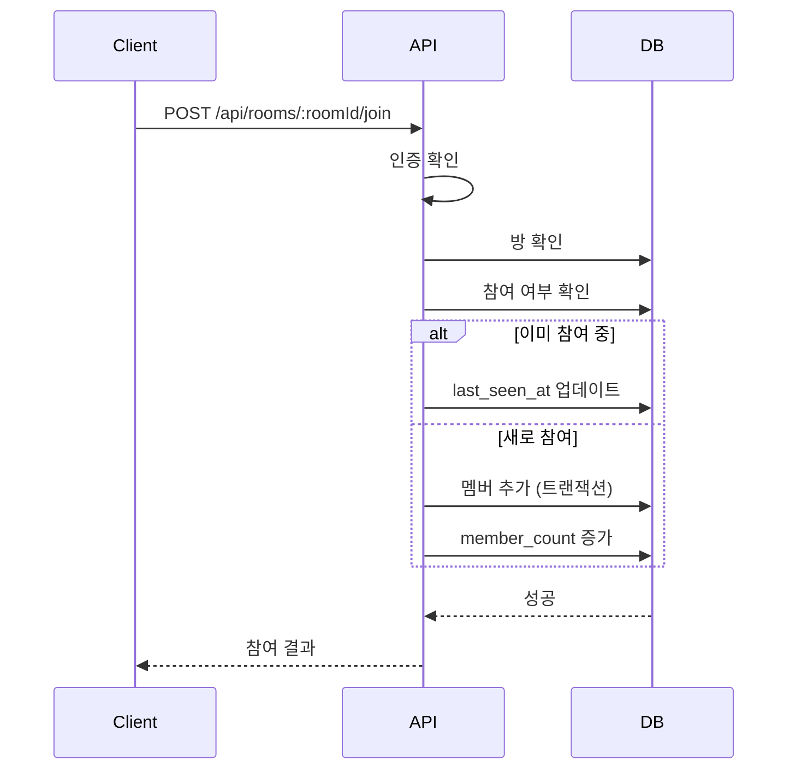
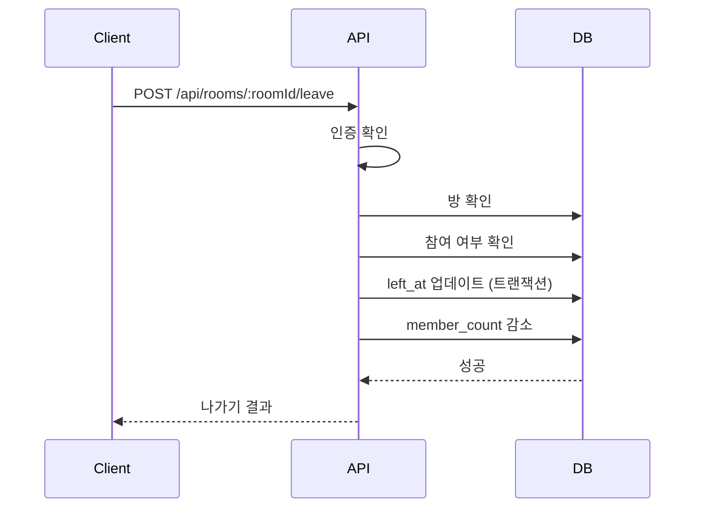
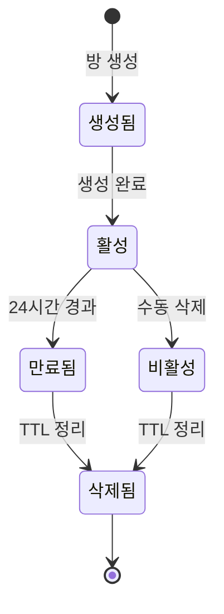
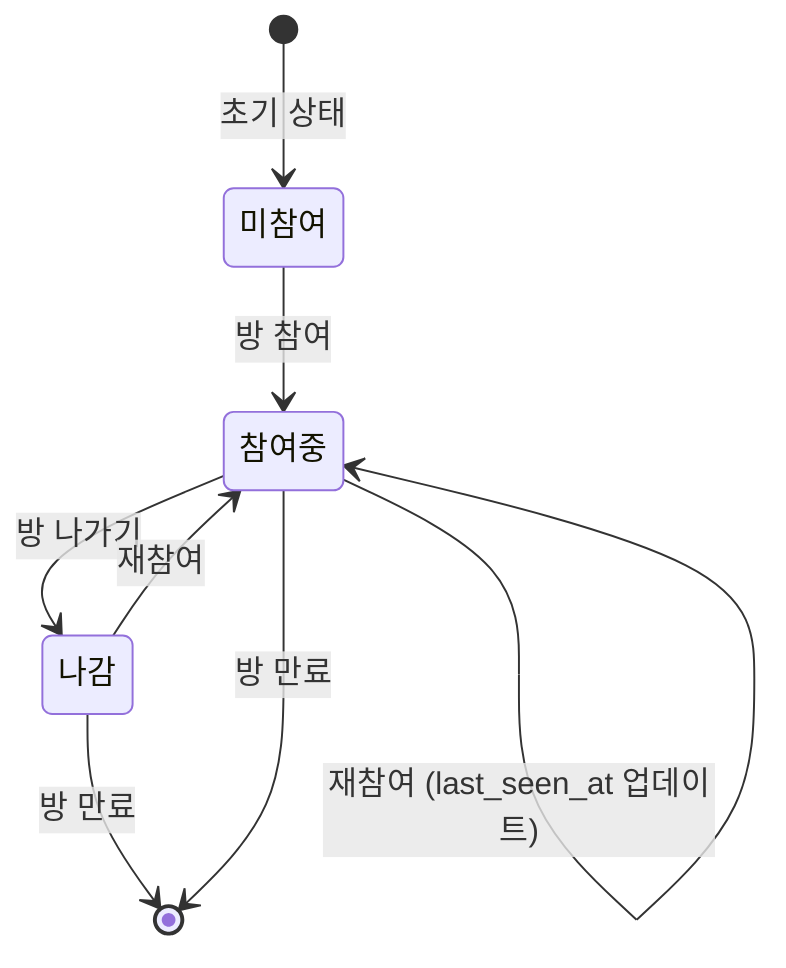

# 방 관리 (Room Management)

## 기능 개요

방 관리 기능은 YEO.PE 서비스의 핵심 기능으로, 사용자가 채팅방을 생성하고 참여할 수 있게 합니다. 모든 방은 24시간 TTL(Time To Live)을 가지며, 만료 시 자동으로 삭제됩니다.

### 목적

- 채팅방 생성 및 관리
- 근처 활성 방 목록 조회
- 방 참여 및 나가기
- 방 멤버 관리

### 우선순위

**높음** - MVP 핵심 기능

---

## 전제 조건

### 방 생성

- 로그인 상태 (인증 필요)
- 방 이름 (1-255자)
- 카테고리 (선택, 기본값: "general")

### 방 참여

- 로그인 상태 (인증 필요)
- 활성 상태인 방 (만료되지 않음)

### 방 조회

- 인증 선택적 (비회원도 읽기 가능)

---

## 기능별 상세 명세

### 1. 방 생성 (Create Room)

#### 기능 설명

사용자가 새로운 채팅방을 생성합니다. 생성된 방은 24시간 후 자동으로 만료됩니다.

#### API 명세

**엔드포인트**: `POST /api/rooms`

**인증**: 필요 (Access Token)

**Rate Limit**: 10회/시간

**요청 헤더**:
```
Authorization: Bearer {access_token}
```

**요청 본문**:
```json
{
  "name": "지하철 2호선",
  "category": "transport"
}
```

**응답** (201 Created):
```json
{
  "roomId": "550e8400-e29b-41d4-a716-446655440000",
  "name": "지하철 2호선",
  "createdAt": "2024-01-01T00:00:00.000Z",
  "expiresAt": "2024-01-02T00:00:00.000Z",
  "memberCount": 1,
  "metadata": {
    "category": "transport"
  }
}
```

#### 동작 방식

1. **인증 확인**
   - Access Token 검증
   - 사용자 ID 추출

2. **입력 검증**
   - 방 이름 필수 확인
   - 방 이름 길이 검증 (1-255자)
   - 카테고리 검증 (유효한 값: "general", "transport", "event", "venue")

3. **방 생성**
   - 고유한 `roomId` 생성 (UUID)
   - 만료 시간 설정 (현재 시간 + 24시간)
   - 초기 멤버 수: 1 (생성자 포함)
   - `is_active`: true

4. **생성자를 멤버로 추가**
   - `room_members` 테이블에 생성자 추가
   - `role`: "creator"

5. **응답 반환**
   - 생성된 방 정보 반환

#### 예외 처리

| 에러 코드 | 상황 | 응답 메시지 |
|----------|------|------------|
| 401 | 인증 실패 | "인증이 필요합니다" |
| 400 | 방 이름 없음 | "방 이름을 입력해주세요" |
| 400 | 방 이름 길이 초과 | "방 이름은 255자 이하여야 합니다" |
| 400 | 유효하지 않은 카테고리 | "유효하지 않은 카테고리입니다" |
| 429 | Rate Limit 초과 | "너무 많은 요청입니다. 잠시 후 다시 시도해주세요" |

#### UI/UX 플로우

```
[방 생성 화면]
  ↓
[방 이름, 카테고리 입력]
  ↓
[생성 버튼 클릭]
  ↓
[로딩 표시]
  ↓
[성공] → [생성된 방으로 이동] → [채팅 화면]
[실패] → [에러 메시지 표시] → [재입력]
```

#### 테스트 케이스

**성공 시나리오**:
1. 유효한 방 이름과 카테고리로 방 생성
2. 방이 정상적으로 생성되고 생성자가 멤버로 추가됨
3. 만료 시간이 24시간 후로 설정됨

**실패 시나리오**:
1. 인증 없이 요청 → 401 에러
2. 방 이름 없음 → 400 에러
3. 방 이름 255자 초과 → 400 에러
4. 유효하지 않은 카테고리 → 400 에러
5. Rate Limit 초과 → 429 에러

---

### 2. 근처 활성 방 목록 조회 (Get Nearby Rooms)

#### 기능 설명

현재 활성 상태인 방 목록을 조회합니다. 비회원도 읽기 가능합니다.

#### API 명세

**엔드포인트**: `GET /api/rooms/nearby`

**인증**: 선택적 (비회원도 접근 가능)

**쿼리 파라미터**:
- `limit`: 조회할 방 개수 (기본값: 10, 최대: 50)
- `category`: 카테고리 필터 (선택)
- `before`: 페이징을 위한 타임스탬프 (선택)

**요청 예시**:
```
GET /api/rooms/nearby?limit=20&category=transport
```

**응답** (200 OK):
```json
{
  "rooms": [
    {
      "id": "550e8400-e29b-41d4-a716-446655440000",
      "roomId": "550e8400-e29b-41d4-a716-446655440000",
      "name": "지하철 2호선",
      "creatorId": "660e8400-e29b-41d4-a716-446655440001",
      "creatorNicknameMask": "김**",
      "createdAt": "2024-01-01T00:00:00.000Z",
      "expiresAt": "2024-01-02T00:00:00.000Z",
      "memberCount": 5,
      "metadata": {
        "category": "transport"
      }
    }
  ]
}
```

#### 동작 방식

1. **쿼리 파라미터 파싱**
   - `limit`: 기본값 10, 최대 50
   - `category`: 선택적 필터
   - `before`: 페이징용 타임스탬프

2. **활성 방 조회**
   - `is_active = true`
   - `expires_at > NOW()`
   - 카테고리 필터 적용 (있는 경우)
   - `before` 파라미터로 페이징 (있는 경우)
   - 생성일 기준 내림차순 정렬

3. **생성자 정보 조인**
   - 생성자의 마스킹된 닉네임 포함

4. **응답 반환**
   - 방 목록 반환

#### 예외 처리

| 에러 코드 | 상황 | 응답 메시지 |
|----------|------|------------|
| 400 | limit 초과 | "limit은 50을 초과할 수 없습니다" |

#### UI/UX 플로우

```
[메인 화면]
  ↓
[근처 방 목록 자동 로드]
  ↓
[방 목록 표시]
  ↓
[방 클릭] → [방 상세 화면]
[새로고침] → [목록 갱신]
```

#### 테스트 케이스

**성공 시나리오**:
1. 활성 방 목록 정상 조회
2. 카테고리 필터 적용
3. 페이징 동작 확인
4. 비회원도 접근 가능

**실패 시나리오**:
1. limit 50 초과 → 400 에러

---

### 3. 내가 참여 중인 방 목록 조회 (Get My Rooms)

#### 기능 설명

현재 사용자가 참여 중인 활성 방 목록을 조회합니다.

#### API 명세

**엔드포인트**: `GET /api/rooms/my`

**인증**: 필요 (Access Token)

**요청 헤더**:
```
Authorization: Bearer {access_token}
```

**응답** (200 OK):
```json
{
  "rooms": [
    {
      "id": "550e8400-e29b-41d4-a716-446655440000",
      "roomId": "550e8400-e29b-41d4-a716-446655440000",
      "name": "지하철 2호선",
      "role": "member",
      "memberCount": 5,
      "joinedAt": "2024-01-01T00:00:00.000Z",
      "lastSeenAt": "2024-01-01T12:00:00.000Z",
      "expiresAt": "2024-01-02T00:00:00.000Z",
      "metadata": {
        "category": "transport"
      }
    }
  ]
}
```

#### 동작 방식

1. **인증 확인**
   - Access Token 검증
   - 사용자 ID 추출

2. **참여 중인 방 조회**
   - `room_members` 테이블에서 `left_at IS NULL`인 방 조회
   - 활성 상태인 방만 (`is_active = true`, `expires_at > NOW()`)
   - `last_seen_at` 기준 내림차순 정렬

3. **응답 반환**
   - 방 목록 반환 (역할, 참여 시간 포함)

#### 예외 처리

| 에러 코드 | 상황 | 응답 메시지 |
|----------|------|------------|
| 401 | 인증 실패 | "인증이 필요합니다" |

---

### 4. 방 상세 정보 조회 (Get Room Details)

#### 기능 설명

특정 방의 상세 정보를 조회합니다. 비회원도 읽기 가능합니다.

#### API 명세

**엔드포인트**: `GET /api/rooms/:roomId`

**인증**: 선택적 (비회원도 접근 가능)

**경로 파라미터**:
- `roomId`: 방 ID (UUID)

**응답** (200 OK):
```json
{
  "id": "550e8400-e29b-41d4-a716-446655440000",
  "roomId": "550e8400-e29b-41d4-a716-446655440000",
  "name": "지하철 2호선",
  "creatorId": "660e8400-e29b-41d4-a716-446655440001",
  "createdAt": "2024-01-01T00:00:00.000Z",
  "expiresAt": "2024-01-02T00:00:00.000Z",
  "memberCount": 5,
  "isActive": true,
  "metadata": {
    "category": "transport"
  }
}
```

#### 동작 방식

1. **방 조회**
   - `roomId`로 활성 방 조회

2. **만료 확인**
   - 만료된 방인지 확인

3. **응답 반환**
   - 방 상세 정보 반환

#### 예외 처리

| 에러 코드 | 상황 | 응답 메시지 |
|----------|------|------------|
| 404 | 방 없음 | "방을 찾을 수 없습니다" |
| 404 | 만료된 방 | "만료된 방입니다" |

---

### 5. 방 참여 (Join Room)

#### 기능 설명

사용자가 특정 방에 참여합니다. 이미 참여 중인 경우 재참여 처리됩니다.

#### API 명세

**엔드포인트**: `POST /api/rooms/:roomId/join`

**인증**: 필요 (Access Token)

**경로 파라미터**:
- `roomId`: 방 ID (UUID)

**요청 헤더**:
```
Authorization: Bearer {access_token}
```

**응답** (200 OK):
```json
{
  "roomId": "550e8400-e29b-41d4-a716-446655440000",
  "message": "방에 참여했습니다"
}
```

**이미 참여 중인 경우**:
```json
{
  "message": "이미 참여 중인 방입니다",
  "roomId": "550e8400-e29b-41d4-a716-446655440000"
}
```

#### 동작 방식

1. **인증 확인**
   - Access Token 검증
   - 사용자 ID 추출

2. **방 확인**
   - 방 존재 여부 확인
   - 만료 여부 확인

3. **참여 여부 확인**
   - 이미 참여 중인지 확인 (`left_at IS NULL`)

4. **방 참여 처리** (트랜잭션)
   - `room_members` 테이블에 멤버 추가
   - `role`: "member"
   - `rooms` 테이블의 `member_count` 증가

5. **재참여 처리**
   - 이미 참여 중인 경우 `last_seen_at`만 업데이트

6. **응답 반환**
   - 참여 결과 반환

#### 예외 처리

| 에러 코드 | 상황 | 응답 메시지 |
|----------|------|------------|
| 401 | 인증 실패 | "인증이 필요합니다" |
| 404 | 방 없음 | "방을 찾을 수 없습니다" |
| 400 | 만료된 방 | "만료된 방입니다" |

#### UI/UX 플로우

```
[방 목록 화면]
  ↓
[방 클릭]
  ↓
[방 상세 화면]
  ↓
[참여 버튼 클릭]
  ↓
[로딩 표시]
  ↓
[성공] → [채팅 화면으로 이동]
[실패] → [에러 메시지 표시]
```

#### 테스트 케이스

**성공 시나리오**:
1. 활성 방에 정상 참여
2. 멤버 수 증가 확인
3. 이미 참여 중인 방 재참여 시 `last_seen_at` 업데이트

**실패 시나리오**:
1. 인증 없이 요청 → 401 에러
2. 존재하지 않는 방 → 404 에러
3. 만료된 방 → 400 에러

---

### 6. 방 나가기 (Leave Room)

#### 기능 설명

사용자가 참여 중인 방에서 나갑니다.

#### API 명세

**엔드포인트**: `POST /api/rooms/:roomId/leave`

**인증**: 필요 (Access Token)

**경로 파라미터**:
- `roomId`: 방 ID (UUID)

**요청 헤더**:
```
Authorization: Bearer {access_token}
```

**응답** (200 OK):
```json
{
  "roomId": "550e8400-e29b-41d4-a716-446655440000",
  "message": "방에서 나갔습니다"
}
```

#### 동작 방식

1. **인증 확인**
   - Access Token 검증
   - 사용자 ID 추출

2. **방 확인**
   - 방 존재 여부 확인

3. **참여 여부 확인**
   - 참여 중인지 확인 (`left_at IS NULL`)

4. **방 나가기 처리** (트랜잭션)
   - `room_members` 테이블의 `left_at` 업데이트
   - `rooms` 테이블의 `member_count` 감소 (최소 0)

5. **응답 반환**
   - 나가기 결과 반환

#### 예외 처리

| 에러 코드 | 상황 | 응답 메시지 |
|----------|------|------------|
| 401 | 인증 실패 | "인증이 필요합니다" |
| 404 | 방 없음 | "방을 찾을 수 없습니다" |
| 400 | 참여 중이 아님 | "참여 중인 방이 아닙니다" |

#### UI/UX 플로우

```
[채팅 화면]
  ↓
[설정 메뉴]
  ↓
[방 나가기 버튼 클릭]
  ↓
[확인 다이얼로그]
  ↓
[확인] → [API 호출] → [방 목록 화면으로 이동]
```

#### 테스트 케이스

**성공 시나리오**:
1. 참여 중인 방에서 정상적으로 나가기
2. 멤버 수 감소 확인
3. `left_at` 필드 업데이트 확인

**실패 시나리오**:
1. 인증 없이 요청 → 401 에러
2. 존재하지 않는 방 → 404 에러
3. 참여 중이 아닌 방 → 400 에러

---

### 7. 방 멤버 목록 조회 (Get Room Members)

#### 기능 설명

특정 방의 멤버 목록을 조회합니다.

#### API 명세

**엔드포인트**: `GET /api/rooms/:roomId/members`

**인증**: 필요 (Access Token)

**경로 파라미터**:
- `roomId`: 방 ID (UUID)

**요청 헤더**:
```
Authorization: Bearer {access_token}
```

**응답** (200 OK):
```json
{
  "members": [
    {
      "userId": "660e8400-e29b-41d4-a716-446655440001",
      "nickname": "김철수",
      "nicknameMask": "김**",
      "role": "creator",
      "joinedAt": "2024-01-01T00:00:00.000Z",
      "lastSeenAt": "2024-01-01T12:00:00.000Z"
    },
    {
      "userId": "770e8400-e29b-41d4-a716-446655440002",
      "nickname": "이영희",
      "nicknameMask": "이**",
      "role": "member",
      "joinedAt": "2024-01-01T01:00:00.000Z",
      "lastSeenAt": "2024-01-01T12:00:00.000Z"
    }
  ]
}
```

#### 동작 방식

1. **인증 확인**
   - Access Token 검증

2. **방 확인**
   - 방 존재 여부 확인

3. **멤버 목록 조회**
   - `room_members` 테이블에서 `left_at IS NULL`인 멤버 조회
   - 사용자 정보 조인 (닉네임, 마스킹된 닉네임)
   - `joined_at` 기준 오름차순 정렬

4. **응답 반환**
   - 멤버 목록 반환

#### 예외 처리

| 에러 코드 | 상황 | 응답 메시지 |
|----------|------|------------|
| 401 | 인증 실패 | "인증이 필요합니다" |
| 404 | 방 없음 | "방을 찾을 수 없습니다" |

---

## 시퀀스 다이어그램

### 방 생성 플로우



### 방 참여 플로우



### 방 나가기 플로우



---

## 상태 다이어그램

### 방 상태 전이



### 사용자-방 관계 상태



---

## 데이터 모델

### Room 엔티티

```typescript
interface Room {
  id: UUID;                    // 내부 ID
  roomId: UUID;                // 공개 ID
  name: string;                // 방 이름 (1-255자)
  creatorId: UUID;             // 생성자 ID
  createdAt: Timestamp;        // 생성 시간
  expiresAt: Timestamp;        // 만료 시간 (생성 + 24시간)
  memberCount: number;         // 멤버 수
  isActive: boolean;           // 활성 상태
  metadata: {                  // 메타데이터
    category: string;          // 카테고리
  };
}
```

### RoomMember 엔티티

```typescript
interface RoomMember {
  id: UUID;
  roomId: UUID;
  userId: UUID;
  role: 'creator' | 'member';  // 역할
  joinedAt: Timestamp;         // 참여 시간
  leftAt: Timestamp | null;    // 나간 시간 (null이면 참여 중)
  lastSeenAt: Timestamp;       // 마지막 활동 시간
}
```

---

## 참고 자료

- [방 서비스](../server/src/services/roomService.js)
- [방 라우트](../server/src/routes/rooms.js)
- [데이터베이스 스키마](../architecture/architecture.md#41-postgresql-스키마)

