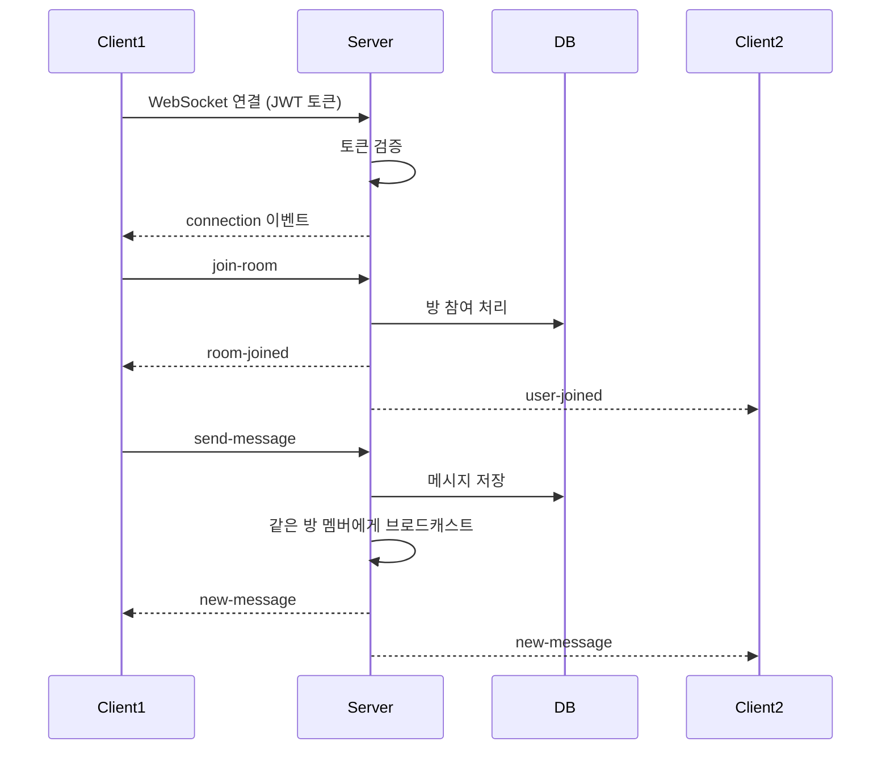
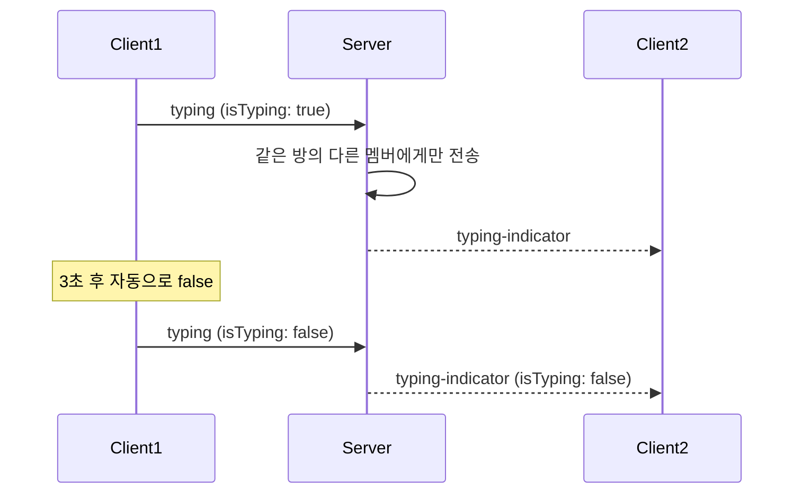
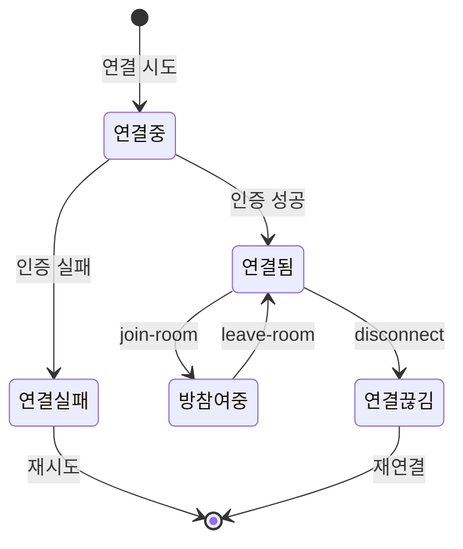

# 실시간 채팅 (Real-time Chat)

## 기능 개요

실시간 채팅 기능은 WebSocket을 사용하여 사용자 간 실시간 메시지 교환을 가능하게 합니다. Socket.io를 기반으로 하며, 방 단위로 메시지를 그룹화합니다.

### 목적

- 실시간 메시지 전송 및 수신
- 방 단위 그룹 채팅
- 타이핑 인디케이터
- 실시간 멤버 상태 업데이트

### 우선순위

**높음** - MVP 핵심 기능

---

## 전제 조건

### WebSocket 연결

- 유효한 JWT Access Token
- Socket.io 클라이언트 라이브러리

### 메시지 전송

- 로그인 상태 (인증 필요)
- 방에 참여 중인 상태
- 활성 상태인 방 (만료되지 않음)

### 메시지 조회

- 인증 선택적 (비회원도 읽기 가능)

---

## 기능별 상세 명세

### 1. WebSocket 연결 및 인증

#### 기능 설명

클라이언트가 WebSocket 서버에 연결하고 JWT 토큰으로 인증합니다.

#### 연결 엔드포인트

**URL**: `wss://yeop3.com/socket` (프로덕션)  
**프로토콜**: Socket.io over WebSocket

#### 인증 방법

**방법 1: 쿼리 파라미터**
```
wss://yeop3.com/socket?token={access_token}
```

**방법 2: auth 객체**
```javascript
const socket = io('wss://yeop3.com/socket', {
  auth: {
    token: accessToken
  }
});
```

#### 연결 플로우

1. **클라이언트 연결 요청**
   - Socket.io 클라이언트가 서버에 연결 시도

2. **인증 미들웨어 실행**
   - `socket.handshake.auth.token` 또는 `socket.handshake.query.token`에서 토큰 추출
   - JWT 토큰 검증
   - 사용자 정보 추출

3. **연결 성공/실패**
   - 성공: `connection` 이벤트 발생
   - 실패: `connect_error` 이벤트 발생

#### 예외 처리

| 에러 | 상황 | 처리 |
|------|------|------|
| `connect_error` | 토큰 없음 | "인증 토큰이 필요합니다" |
| `connect_error` | 유효하지 않은 토큰 | "유효하지 않은 토큰입니다" |

#### 클라이언트 예시 코드

```javascript
import io from 'socket.io-client';

const socket = io('wss://yeop3.com/socket', {
  auth: {
    token: accessToken
  },
  transports: ['websocket']
});

socket.on('connect', () => {
  console.log('WebSocket 연결 성공');
});

socket.on('connect_error', (error) => {
  console.error('연결 오류:', error.message);
});
```

---

### 2. 방 참여 (WebSocket)

#### 기능 설명

WebSocket을 통해 방에 참여합니다. Socket.io Room에 자동으로 추가됩니다.

#### 이벤트 명세

**클라이언트 → 서버**: `join-room`

**요청 데이터**:
```json
{
  "roomId": "550e8400-e29b-41d4-a716-446655440000"
}
```

**서버 → 클라이언트**: `room-joined`

**응답 데이터**:
```json
{
  "roomId": "550e8400-e29b-41d4-a716-446655440000",
  "memberCount": 5
}
```

**서버 → 다른 클라이언트**: `user-joined`

**알림 데이터**:
```json
{
  "roomId": "550e8400-e29b-41d4-a716-446655440000",
  "userId": "660e8400-e29b-41d4-a716-446655440001",
  "nicknameMask": "김**",
  "memberCount": 6
}
```

#### 동작 방식

1. **클라이언트 이벤트 전송**
   - `join-room` 이벤트와 `roomId` 전송

2. **서버 처리**
   - 방 존재 및 만료 확인
   - 데이터베이스에 방 참여 처리 (이미 참여 중이 아닌 경우)
   - Socket.io Room에 소켓 추가 (`socket.join(room:${roomId})`)

3. **응답 전송**
   - 본인에게 `room-joined` 이벤트 전송
   - 다른 멤버들에게 `user-joined` 이벤트 전송 (새로 참여한 경우)

#### 예외 처리

| 에러 이벤트 | 상황 | 응답 |
|------------|------|------|
| `error` | roomId 없음 | `{ message: "roomId가 필요합니다" }` |
| `error` | 방 없음 | `{ message: "방을 찾을 수 없습니다" }` |
| `error` | 만료된 방 | `{ message: "만료된 방입니다" }` |

#### 클라이언트 예시 코드

```javascript
socket.emit('join-room', {
  roomId: '550e8400-e29b-41d4-a716-446655440000'
});

socket.on('room-joined', (data) => {
  console.log('방 참여 성공:', data);
});

socket.on('user-joined', (data) => {
  console.log('새 멤버 참여:', data);
});
```

---

### 3. 방 나가기 (WebSocket)

#### 기능 설명

WebSocket을 통해 방에서 나갑니다. Socket.io Room에서 자동으로 제거됩니다.

#### 이벤트 명세

**클라이언트 → 서버**: `leave-room`

**요청 데이터**:
```json
{
  "roomId": "550e8400-e29b-41d4-a716-446655440000"
}
```

**서버 → 클라이언트**: `room-left`

**응답 데이터**:
```json
{
  "roomId": "550e8400-e29b-41d4-a716-446655440000"
}
```

**서버 → 다른 클라이언트**: `user-left`

**알림 데이터**:
```json
{
  "roomId": "550e8400-e29b-41d4-a716-446655440000",
  "userId": "660e8400-e29b-41d4-a716-446655440001",
  "memberCount": 4
}
```

#### 동작 방식

1. **클라이언트 이벤트 전송**
   - `leave-room` 이벤트와 `roomId` 전송

2. **서버 처리**
   - 데이터베이스에 방 나가기 처리
   - Socket.io Room에서 소켓 제거 (`socket.leave(room:${roomId})`)

3. **응답 전송**
   - 본인에게 `room-left` 이벤트 전송
   - 다른 멤버들에게 `user-left` 이벤트 전송

#### 예외 처리

| 에러 이벤트 | 상황 | 응답 |
|------------|------|------|
| `error` | roomId 없음 | `{ message: "roomId가 필요합니다" }` |
| `error` | 방 없음 | `{ message: "방을 찾을 수 없습니다" }` |
| `error` | 참여 중이 아님 | `{ message: "참여 중인 방이 아닙니다" }` |

---

### 4. 메시지 전송 (WebSocket)

#### 기능 설명

WebSocket을 통해 실시간으로 메시지를 전송합니다. 같은 방의 모든 멤버에게 즉시 전달됩니다.

#### 이벤트 명세

**클라이언트 → 서버**: `send-message`

**요청 데이터**:
```json
{
  "roomId": "550e8400-e29b-41d4-a716-446655440000",
  "type": "text",
  "content": "안녕하세요!"
}
```

**이미지 메시지**:
```json
{
  "roomId": "550e8400-e29b-41d4-a716-446655440000",
  "type": "image",
  "imageUrl": "https://objectstorage.../image.jpg"
}
```

**서버 → 모든 클라이언트**: `new-message`

**응답 데이터**:
```json
{
  "messageId": "770e8400-e29b-41d4-a716-446655440003",
  "roomId": "550e8400-e29b-41d4-a716-446655440000",
  "userId": "660e8400-e29b-41d4-a716-446655440001",
  "nicknameMask": "김**",
  "type": "text",
  "content": "안녕하세요!",
  "imageUrl": null,
  "createdAt": "2024-01-01T12:00:00.000Z"
}
```

#### 동작 방식

1. **클라이언트 이벤트 전송**
   - `send-message` 이벤트와 메시지 데이터 전송

2. **서버 검증**
   - 방 존재 및 만료 확인
   - 사용자가 방에 참여 중인지 확인
   - 메시지 타입 검증 (text, image, emoji)
   - 텍스트 메시지 길이 검증 (최대 1000자)

3. **메시지 저장**
   - 데이터베이스에 메시지 저장
   - 만료 시간 설정 (방과 동일하게 24시간)

4. **브로드캐스트**
   - 같은 방의 모든 멤버에게 `new-message` 이벤트 전송
   - `io.to(room:${roomId}).emit('new-message', data)`

#### 예외 처리

| 에러 이벤트 | 상황 | 응답 |
|------------|------|------|
| `error` | roomId 없음 | `{ message: "roomId가 필요합니다" }` |
| `error` | 방 없음 | `{ message: "방을 찾을 수 없습니다" }` |
| `error` | 만료된 방 | `{ message: "만료된 방입니다" }` |
| `error` | 참여 중이 아님 | `{ message: "방에 참여 중이 아닙니다" }` |
| `error` | 유효하지 않은 타입 | `{ message: "유효하지 않은 메시지 타입입니다" }` |
| `error` | 메시지 내용 없음 | `{ message: "메시지 내용을 입력해주세요" }` |
| `error` | 메시지 길이 초과 | `{ message: "메시지는 1000자 이하여야 합니다" }` |

#### 클라이언트 예시 코드

```javascript
socket.emit('send-message', {
  roomId: '550e8400-e29b-41d4-a716-446655440000',
  type: 'text',
  content: '안녕하세요!'
});

socket.on('new-message', (message) => {
  console.log('새 메시지:', message);
  // UI에 메시지 추가
});
```

---

### 5. 타이핑 인디케이터

#### 기능 설명

사용자가 메시지를 입력 중일 때 다른 멤버들에게 알립니다.

#### 이벤트 명세

**클라이언트 → 서버**: `typing`

**요청 데이터**:
```json
{
  "roomId": "550e8400-e29b-41d4-a716-446655440000",
  "isTyping": true
}
```

**서버 → 다른 클라이언트**: `typing-indicator`

**알림 데이터**:
```json
{
  "roomId": "550e8400-e29b-41d4-a716-446655440000",
  "userId": "660e8400-e29b-41d4-a716-446655440001",
  "nicknameMask": "김**",
  "isTyping": true
}
```

#### 동작 방식

1. **클라이언트 이벤트 전송**
   - 사용자가 입력 시작: `isTyping: true`
   - 사용자가 입력 중지: `isTyping: false`

2. **서버 브로드캐스트**
   - 같은 방의 다른 멤버들에게만 전송 (본인 제외)
   - `socket.to(room:${roomId}).emit('typing-indicator', data)`

#### 클라이언트 예시 코드

```javascript
let typingTimeout;

inputElement.addEventListener('input', () => {
  socket.emit('typing', {
    roomId: currentRoomId,
    isTyping: true
  });

  clearTimeout(typingTimeout);
  typingTimeout = setTimeout(() => {
    socket.emit('typing', {
      roomId: currentRoomId,
      isTyping: false
    });
  }, 3000); // 3초 후 자동으로 false
});

socket.on('typing-indicator', (data) => {
  if (data.isTyping) {
    showTypingIndicator(data.nicknameMask);
  } else {
    hideTypingIndicator(data.userId);
  }
});
```

---

### 6. 메시지 목록 조회 (REST API)

#### 기능 설명

REST API를 통해 방의 메시지 목록을 조회합니다. 비회원도 읽기 가능합니다.

#### API 명세

**엔드포인트**: `GET /api/rooms/:roomId/messages`

**인증**: 선택적 (비회원도 접근 가능)

**쿼리 파라미터**:
- `limit`: 조회할 메시지 개수 (기본값: 50, 최대: 100)
- `before`: 페이징을 위한 메시지 ID (선택)

**요청 예시**:
```
GET /api/rooms/550e8400-e29b-41d4-a716-446655440000/messages?limit=50
```

**응답** (200 OK):
```json
{
  "messages": [
    {
      "messageId": "770e8400-e29b-41d4-a716-446655440003",
      "userId": "660e8400-e29b-41d4-a716-446655440001",
      "nickname": "김철수",
      "nicknameMask": "김**",
      "type": "text",
      "content": "안녕하세요!",
      "imageUrl": null,
      "createdAt": "2024-01-01T12:00:00.000Z"
    }
  ],
  "hasMore": true
}
```

#### 동작 방식

1. **방 확인**
   - 방 존재 여부 확인

2. **메시지 조회**
   - `is_deleted = false`인 메시지만 조회
   - `before` 파라미터로 페이징 (있는 경우)
   - 생성일 기준 내림차순 정렬
   - 최신 메시지가 먼저 오도록 역순 정렬

3. **응답 반환**
   - 메시지 목록 및 `hasMore` 플래그 반환

#### 예외 처리

| 에러 코드 | 상황 | 응답 메시지 |
|----------|------|------------|
| 404 | 방 없음 | "방을 찾을 수 없습니다" |
| 400 | limit 초과 | "limit은 100을 초과할 수 없습니다" |

---

### 7. 메시지 삭제 (REST API)

#### 기능 설명

본인이 작성한 메시지를 삭제합니다. 소프트 삭제 방식입니다.

#### API 명세

**엔드포인트**: `DELETE /api/messages/:messageId`

**인증**: 필요 (Access Token)

**경로 파라미터**:
- `messageId`: 메시지 ID (UUID)

**요청 헤더**:
```
Authorization: Bearer {access_token}
```

**응답** (200 OK):
```json
{
  "success": true
}
```

#### 동작 방식

1. **인증 확인**
   - Access Token 검증
   - 사용자 ID 추출

2. **메시지 확인**
   - 메시지 존재 여부 확인
   - 본인 메시지인지 확인

3. **소프트 삭제**
   - `is_deleted` 필드를 `true`로 업데이트
   - 실제 데이터는 삭제하지 않음 (TTL 정리 시 삭제)

4. **응답 반환**
   - 삭제 성공 응답

#### 예외 처리

| 에러 코드 | 상황 | 응답 메시지 |
|----------|------|------------|
| 401 | 인증 실패 | "인증이 필요합니다" |
| 404 | 메시지 없음 | "메시지를 찾을 수 없습니다" |
| 403 | 본인 메시지 아님 | "본인의 메시지만 삭제할 수 있습니다" |

---

## 시퀀스 다이어그램

### WebSocket 연결 및 메시지 전송 플로우



### 타이핑 인디케이터 플로우



---

## 상태 다이어그램

### WebSocket 연결 상태



---

## 메시지 타입

### 텍스트 메시지

```json
{
  "type": "text",
  "content": "메시지 내용 (최대 1000자)"
}
```

### 이미지 메시지

```json
{
  "type": "image",
  "imageUrl": "https://objectstorage.../image.jpg"
}
```

### 이모지 메시지

```json
{
  "type": "emoji",
  "content": "😀"
}
```

---

## 성능 고려사항

### 메시지 브로드캐스트

- Socket.io의 Room 기능을 사용하여 효율적인 브로드캐스트
- 같은 방의 멤버에게만 메시지 전송

### 페이징

- 메시지 목록 조회 시 페이징 지원
- `before` 파라미터로 이전 메시지 조회

### Rate Limiting

- 메시지 전송: 30회/분
- 무차별 메시지 전송 방지

---

## 참고 자료

- [메시지 서비스](../server/src/services/messageService.js)
- [메시지 핸들러](../server/src/socket/messageHandler.js)
- [방 핸들러](../server/src/socket/roomHandler.js)
- [WebSocket 핸들러](../server/src/socket/socketHandler.js)
- [메시지 라우트](../server/src/routes/messages.js)


