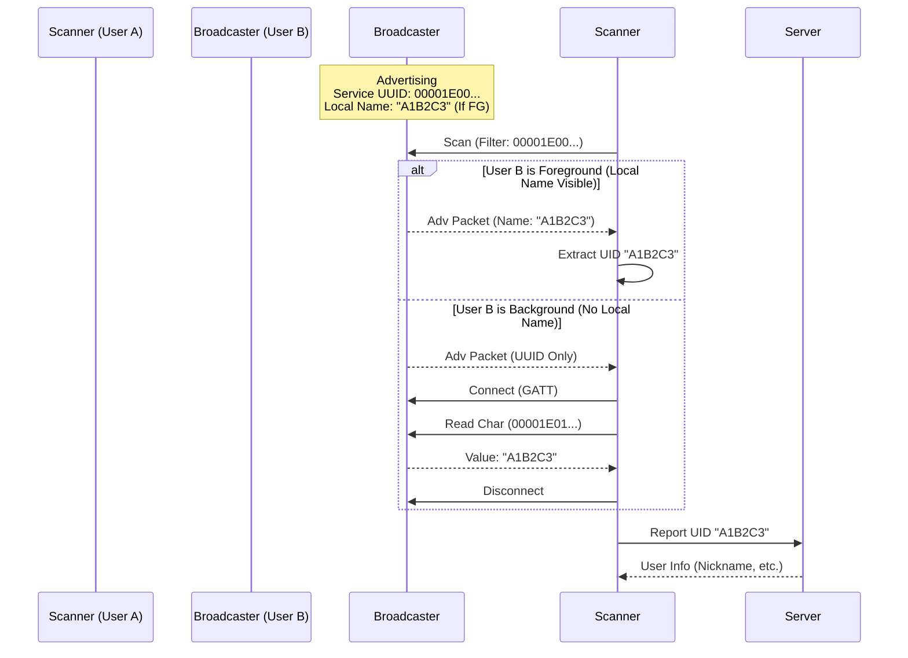

# BLE 탐색 (BLE Discovery)

## 기능 개요

BLE 탐색 기능은 블루투스 Low Energy 신호를 사용하여 실제로 가까이 있는 사용자들을 탐색합니다. GPS 없이 실제 근접성을 기반으로 사용자를 발견하는 YEO.PE의 핵심 차별화 기능입니다.

### 핵심 설계 원칙

**"블루투스는 서로가 근처에 있다는 '출석 체크'용으로만 쓰고, 실제 데이터(채팅, 프로필 이미지 등)는 인터넷(서버)으로 주고받는다"**

- **BLE 역할**: 근처 사용자 존재 확인 (출석 체크)
- **서버 역할**: 모든 실제 데이터 전송 (채팅, 프로필, 방 정보 등)
- **통신 방식**: 
    - **Foreground**: Advertising (Local Name/Manufacturer Data)
    - **Background**: Hybrid (Service UUID Advertising + Characteristic Read)

### 목적

- GPS 없이 실제 근거리 사용자 탐색
- BLE 신호 강도(RSSI) 기반 거리 추정
- 주변 사용자 목록 제공
- 서버를 통한 사용자 정보 매칭

### 우선순위

**높음** - MVP 핵심 기능 (구현 완료)

---

## 전제 조건

### 하드웨어 요구사항

- **iOS**: Bluetooth 4.0 이상 지원 기기
- **Android**: Bluetooth 4.0 이상 지원 기기

### 권한

- **iOS**: `NSBluetoothAlwaysUsageDescription` 권한
- **Android**: `BLUETOOTH`, `BLUETOOTH_ADMIN`, `ACCESS_FINE_LOCATION` (Android 11 이하), `BLUETOOTH_SCAN`, `BLUETOOTH_ADVERTISE`, `BLUETOOTH_CONNECT` (Android 12 이상)

### 설정

- 블루투스 활성화
- 위치 서비스 활성화 (Android, BLE 스캔을 위해 필요)

---

## 아키텍처 개요

### YEO.PE 동작 원리 (하이브리드 방식)

iOS의 백그라운드 제약(Local Name 제거 등)을 극복하기 위해 **하이브리드 방식**을 사용합니다.

1. **Foreground (앱이 켜져 있을 때)**:
   - **Broadcaster**: `Local Name` 영역에 Short UID를 담아 방송합니다. (Android는 Manufacturer Data 사용 가능)
   - **Scanner**: 스캔된 패킷의 `Local Name`을 즉시 파싱하여 UID를 획득합니다. (빠른 탐색)

2. **Background (앱이 내려가 있을 때)**:
   - **Broadcaster**: `Service UUID`만 방송하고, `Local Name`은 OS에 의해 제거됩니다. 대신, **특정 Characteristic**에 UID 값을 담아두고 읽기(Read) 요청을 대기합니다.
   - **Scanner**: `Service UUID`를 가진 기기를 발견하면, **GATT 연결(Connection)**을 시도하여 해당 Characteristic의 값을 읽어 UID를 획득합니다. UID 획득 후 즉시 연결을 해제합니다.

### 통신 방식

- **BLE Advertising**: Service UUID + (Local Name / Manufacturer Data)
- **GATT Connection**: 백그라운드 탐색 시 UID 읽기 용도로만 일시적 사용
- **서버**: 모든 실제 데이터 전송

---

## 기능별 상세 명세

### 1. Short UID 발급

#### 기능 설명

앱 시작 시 서버로부터 오늘 사용할 고유한 Short UID(4~8바이트)를 발급받습니다.

#### API 명세

**엔드포인트**: `POST /api/users/ble/uid`

**인증**: 필요 (Access Token)

**요청 헤더**:
```
Authorization: Bearer {access_token}
```

**응답** (200 OK):
```json
{
  "uid": "A1B2C3",
  "expiresAt": "2024-01-02T00:00:00.000Z"
}
```

---

### 2. BLE 패킷 및 UUID 구조

#### UUID 정의

- **Service UUID**: `00001E00-0000-1000-8000-00805F9B34FB` (YEO.PE 식별용)
- **UID Characteristic UUID**: `00001E01-0000-1000-8000-00805F9B34FB` (백그라운드 UID 읽기용)

#### BLE 광고 패킷 구조

1. **Service UUIDs**: `[00001E00-0000-1000-8000-00805F9B34FB]`
2. **Local Name** (iOS Foreground): `UID` (예: "A1B2C3")
3. **Manufacturer Data** (Android/iOS): App ID (`0xFFFF`) + `UID`

---

### 3. BLE 광고 시작 (Broadcasting)

#### 동작 방식

1. **GATT Service 설정**:
   - Service UUID (`00001E00...`) 생성
   - Characteristic (`00001E01...`) 생성 및 값(UID) 설정 (Read 권한)
   - Service에 Characteristic 추가

2. **Advertising 시작**:
   - Service UUID 포함
   - Local Name에 UID 포함 (Foreground 탐색 최적화)

#### iOS 백그라운드 동작

- iOS는 백그라운드 진입 시 `Local Name`을 광고 패킷에서 제거합니다.
- 하지만 `Service UUID`는 계속 방송되므로, 스캐너는 이를 감지할 수 있습니다.
- 스캐너가 연결(Connect)하여 Characteristic을 읽으면 UID를 확인할 수 있습니다.

---

### 4. BLE 스캔 시작 (Scanning)

#### 동작 방식

1. **스캔 시작**:
   - Service UUID (`00001E00...`)로 필터링하여 스캔

2. **디바이스 발견 시 처리**:
   - **Case A: Local Name 존재 (Foreground)**
     - `Local Name`이 UID 형식(6자리 등)인지 확인
     - 맞다면 즉시 UID 수집 (연결 불필요)
   
   - **Case B: Local Name 없음 (Background)**
     - `Service UUID`가 일치하는지 확인
     - 일치하면 **GATT 연결(Connect)** 시도
     - 서비스 및 Characteristic 탐색
     - Characteristic (`00001E01...`) 값 읽기 (Read Value)
     - UID 획득 후 **연결 해제(Disconnect)**

3. **UID 수집 및 보고**:
   - 수집된 UID와 RSSI를 저장
   - 주기적으로 서버에 보고

---

### 5. 주변 사용자 탐색 (Server Reporting)

#### 기능 설명

BLE 스캔 결과를 서버에 전송하여 주변 사용자 정보를 받아옵니다.

#### API 명세

**엔드포인트**: `POST /api/users/ble/scan`

**인증**: 필요 (Access Token)

**요청 본문**:
```json
{
  "uids": [
    {
      "uid": "A1B2C3",
      "rssi": -65
    }
  ]
}
```

**응답** (200 OK):
```json
{
  "users": [
    {
      "uid": "A1B2C3",
      "nicknameMask": "김**",
      "distance": 15.5,
      "hasActiveRoom": true,
      "roomId": "550e8400-e29b-41d4-a716-446655440000",
      "roomName": "지하철 2호선"
    }
  ]
}
```

---

### 6. 추가 기능 (Quick Question & Boost)

#### 급질문 (Quick Question)

주변 사용자들에게 푸시 알림으로 질문을 보냅니다.

**엔드포인트**: `POST /api/users/quick_question`

**요청 본문**:
```json
{
  "uids": ["A1B2C3", "D4E5F6"],
  "content": "혹시 지금 2호선 성수역 지나나요?"
}
```

#### 신호 증폭 (Boost) - *Deprecated*

자신의 존재를 주변 사용자들에게 알립니다. (현재 `quick_question` 사용 권장)

**엔드포인트**: `POST /api/users/boost`

---

## 시퀀스 다이어그램

### 하이브리드 탐색 플로우



   - 주변 YEO.PE 사용자 정상 탐색
   - Manufacturer Data에서 UID 정상 추출
   - RSSI 값 정상 측정
   - 거리 정보 정확히 계산 및 표시

4. **서버 매칭**
   - UID 목록을 서버에 전송
   - 서버에서 사용자 정보 정상 매칭
   - 주변 사용자 목록 정상 표시

5. **거리 필터링**
   - 30m 이내 사용자만 표시
   - 30m 초과 사용자는 목록에서 제외
   - RSSI -90 dBm 이하 신호 무시

6. **iOS 백그라운드 동작**
   - 화면 꺼진 상태에서도 Service UUID 기반 탐색 가능
   - State Preservation & Restoration 정상 동작

### 실패 시나리오

1. **Short UID 발급 실패**
   - 네트워크 오류 시 재시도 로직
   - 인증 실패 시 로그인 화면으로 이동

2. **블루투스 비활성화**
   - 블루투스 활성화 안내 표시
   - 설정 화면으로 이동 옵션 제공

3. **권한 없음**
   - 권한 요청 다이얼로그 표시
   - 권한 거부 시 기능 비활성화 안내

4. **BLE 미지원**
   - 기기가 BLE를 지원하지 않을 경우 오류 메시지 표시
   - 기능 사용 불가 안내

5. **서버 매칭 실패**
   - 네트워크 오류 시 재시도
   - 유효하지 않은 UID는 무시

6. **iOS 백그라운드 제약**
   - 백그라운드에서 Local Name 사용 시도 시 실패
   - Service UUID와 Manufacturer Data만 사용해야 함

---

## 참고 자료

- [기술 설계서 - BLE 통신 설계](../architecture/architecture.md#6-ble-통신-설계)
- [프로젝트 기획서 - BLE 근거리 탐색](../planning/PROJECT_SPEC.md#3-주요-기능)

