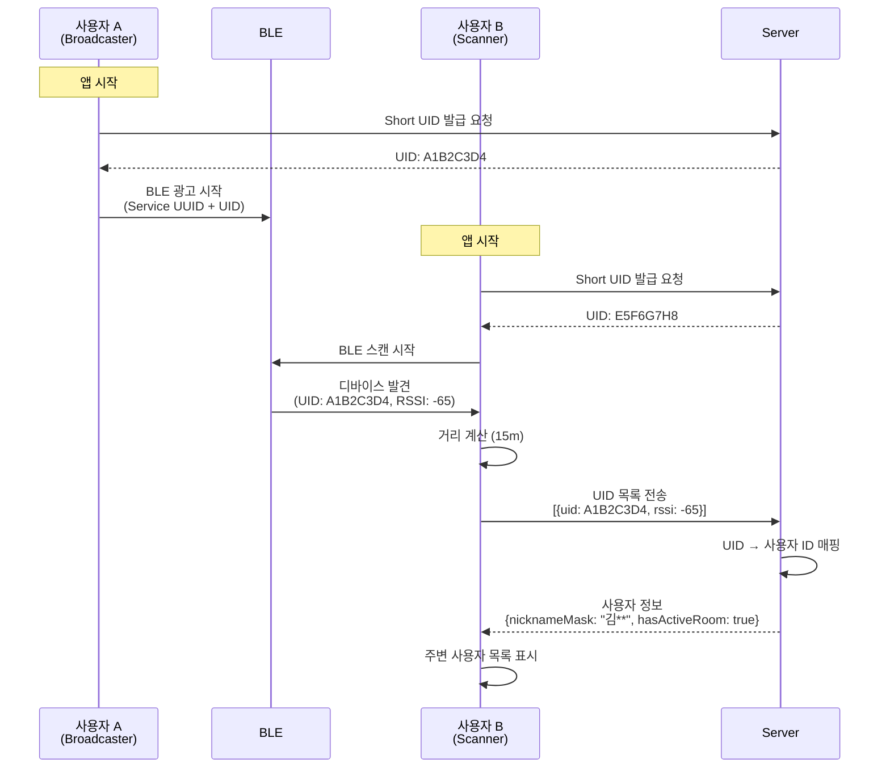
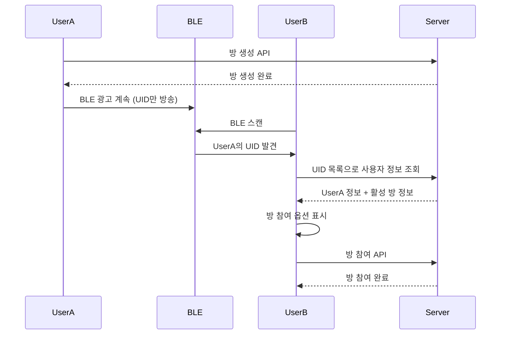

# BLE 탐색 (BLE Discovery)

## 기능 개요

BLE 탐색 기능은 블루투스 Low Energy 신호를 사용하여 실제로 가까이 있는 사용자들을 탐색합니다. GPS 없이 실제 근접성을 기반으로 사용자를 발견하는 YEO.PE의 핵심 차별화 기능입니다.

### 핵심 설계 원칙

**"블루투스는 서로가 근처에 있다는 '출석 체크'용으로만 쓰고, 실제 데이터(채팅, 프로필 이미지 등)는 인터넷(서버)으로 주고받는다"**

- **BLE 역할**: 근처 사용자 존재 확인 (출석 체크)
- **서버 역할**: 모든 실제 데이터 전송 (채팅, 프로필, 방 정보 등)
- **통신 방식**: 페어링 없는 순수 브로드캐스팅 (Connection-less)

### 목적

- GPS 없이 실제 근거리 사용자 탐색
- BLE 신호 강도(RSSI) 기반 거리 추정
- 주변 사용자 목록 제공
- 서버를 통한 사용자 정보 매칭

### 우선순위

**높음** - MVP 핵심 기능 (현재 구현 예정)

### 상태

🚧 **예정** - 모바일 앱 개발 시 구현

---

## 전제 조건

### 하드웨어 요구사항

- **iOS**: Bluetooth 4.0 이상 지원 기기
- **Android**: Bluetooth 4.0 이상 지원 기기

### 권한

- **iOS**: `NSBluetoothAlwaysUsageDescription` 권한
- **Android**: `BLUETOOTH`, `BLUETOOTH_ADMIN`, `ACCESS_FINE_LOCATION` 권한

### 설정

- 블루투스 활성화
- 위치 서비스 활성화 (Android, BLE 스캔을 위해 필요)

---

## 아키텍처 개요

### YEO.PE 동작 원리 (하이브리드 방식)

1. **나 (Broadcaster)**: 내 폰은 주변에 계속 **"내 고유 코드(UID)는 `A1B2`야!"** 라고 BLE 신호(광고 패킷)만 흩뿌립니다. (연결 요청 안 받음)

2. **너 (Scanner)**: 주변 폰들은 이 신호를 잡아서 **"어? 근처에 `A1B2`라는 애가 있네?"** 라고 인식합니다.

3. **서버 (Matchmaker)**: 너의 앱이 서버한테 물어봅니다. "서버야, 내 옆에 `A1B2` 있다는데 걔 누구야?"

4. **결과**: 서버가 정보를 줍니다. "아, `A1B2`? 걔 닉네임 '강남역호랑이'야." → 앱 목록에 표시.

### 통신 방식

- **BLE**: 단방향 브로드캐스팅만 사용 (Advertising & Scanning)
- **GATT Connection**: 사용하지 않음 (페어링 없음)
- **서버**: 모든 실제 데이터 전송

---

## 기능별 상세 명세

### 1. Short UID 발급

#### 기능 설명

앱 시작 시 서버로부터 오늘 사용할 고유한 Short UID(4~8바이트)를 발급받습니다.

#### API 명세

**엔드포인트**: `POST /api/users/ble/uid`

**인증**: 필요 (Access Token)

**요청 헤더**:
```
Authorization: Bearer {access_token}
```

**응답** (200 OK):
```json
{
  "uid": "A1B2C3D4",
  "expiresAt": "2024-01-02T00:00:00.000Z"
}
```

#### 동작 방식

1. **앱 시작 시 호출**
   - 로그인 후 또는 앱 시작 시 자동 호출
   - 서버에서 사용자 ID와 매핑된 Short UID 발급

2. **UID 저장**
   - 로컬 저장소에 저장
   - 만료 시간까지 유효

3. **UID 갱신**
   - 만료 시간 전에 자동 갱신
   - 또는 앱 재시작 시 새로 발급

#### 보안 고려사항

- Short UID는 사용자 ID와 서버에서만 매핑
- 클라이언트는 실제 사용자 ID를 알 수 없음
- UID는 주기적으로 변경 가능 (예: 일일 갱신)

---

### 2. BLE 패킷 구조

#### 기능 설명

BLE 광고 패킷에 YEO.PE 식별 정보와 사용자 UID를 포함합니다.

#### 패킷 설계 (총 31 Bytes)

BLE 광고 패킷의 최대 크기는 31바이트입니다. 우리는 다음 두 가지 정보만 포함합니다:

1. **Service UUID (128-bit)**: YEO.PE 앱 식별용
2. **Manufacturer Data**: 사용자 UID 포함

#### Service UUID

```
Service UUID: 0000YP00-0000-1000-8000-00805F9B34FB
```

- 이 UUID가 있어야 YEO.PE 앱끼리만 반응
- 스캔 필터링에 사용

#### Manufacturer Data 구조

| 데이터 구분 | 사이즈 | 내용 | 비고 |
|------------|--------|------|------|
| **App ID** | 2 Byte | `0xFFFF` | YEO.PE 앱 식별자 |
| **User UID** | 4~8 Byte | `0xA1B2C3D4...` | 서버에서 발급받은 Short UID |

**예시**:
```
Manufacturer Data: [0xFF, 0xFF, 0xA1, 0xB2, 0xC3, 0xD4]
```

#### 패킷 파싱

스캐너는 다음과 같이 파싱합니다:

1. Service UUID로 YEO.PE 앱인지 확인
2. Manufacturer Data에서 App ID 확인 (`0xFFFF`)
3. 나머지 바이트를 User UID로 추출

---

### 3. BLE 광고 시작 (Broadcasting)

#### 기능 설명

내 폰이 주변에 내 UID를 계속 방송합니다. "등대처럼 깜빡깜빡 신호를 보내는 것"입니다.

#### 동작 방식

1. **Short UID 발급**
   - 서버로부터 Short UID 발급받기

2. **BLE 광고 패킷 구성**
   - Service UUID 포함
   - Manufacturer Data에 App ID + User UID 포함

3. **광고 시작**
   - BLE 광고 시작 (연결 요청 받지 않음)
   - 백그라운드에서도 계속 방송

4. **주기적 갱신**
   - UID 만료 시 새로 발급받아 업데이트

#### iOS 구현 주의사항

- **백그라운드 제약**: iOS는 백그라운드에서 Local Name을 날려버리지만, Service UUID와 Manufacturer Data는 계속 방송 가능
- **State Preservation & Restoration**: 백그라운드에서도 신호가 끊기지 않도록 필수 설정
- **iBeacon-like 방식**: Service UUID 기반으로 백그라운드 탐색 가능

#### Android 구현

- **Foreground Service**: 백그라운드에서도 계속 방송하려면 Foreground Service 필요
- **제약 없음**: 포그라운드에서는 완전 자유롭게 방송 가능

---

### 4. BLE 스캔 시작 (Scanning)

#### 기능 설명

주변의 BLE 신호를 스캔하여 다른 YEO.PE 사용자를 탐색합니다.

#### 동작 방식

1. **권한 확인**
   - 블루투스 권한 확인
   - 위치 권한 확인 (Android, BLE 스캔을 위해 필요)

2. **BLE 스캔 시작**
   - BLE 스캔 시작 (주기: 5초)
   - YEO.PE Service UUID로 필터링

3. **신호 수집**
   - 발견된 디바이스의 Manufacturer Data에서 User UID 추출
   - RSSI (신호 강도) 측정
   - 타임스탬프 기록

4. **거리 계산**
   - RSSI 값을 기반으로 거리 추정
   - 30m 이내 사용자만 표시

#### 거리 추정 공식

```
거리(m) ≈ 10^((TxPower - RSSI) / (10 * N))

TxPower: 전송 전력 (일반적으로 -59 dBm)
RSSI: 수신 신호 강도
N: 경로 손실 지수 (일반적으로 2)
```

#### 예외 처리

| 상황 | 처리 |
|------|------|
| 블루투스 비활성화 | 설정 화면 안내 |
| 권한 없음 | 권한 요청 다이얼로그 |
| BLE 미지원 | 오류 메시지 표시 |

---

### 5. 주변 사용자 탐색

#### 기능 설명

BLE 스캔 결과를 서버에 전송하여 주변 사용자 정보를 받아옵니다.

#### 동작 방식

1. **BLE 스캔 결과 수집**
   - 5초마다 스캔 결과 수집
   - Manufacturer Data에서 User UID 추출
   - RSSI 값 기록

2. **서버에 전송**
   - 주기적으로(30초마다) 수집된 UID 목록을 서버에 전송
   - 서버에서 UID를 사용자 정보로 매칭

3. **거리 필터링**
   - 30m 이내 사용자만 표시
   - RSSI 임계값: -90 dBm 이하 무시

4. **사용자 목록 표시**
   - 서버에서 받은 사용자 정보 표시
   - 마스킹된 닉네임 표시
   - 거리 정보 표시

#### API 명세

**엔드포인트**: `POST /api/users/ble/scan`

**인증**: 필요 (Access Token)

**요청 본문**:
```json
{
  "uids": [
    {
      "uid": "A1B2C3D4",
      "rssi": -65,
      "timestamp": 1234567890
    },
    {
      "uid": "E5F6G7H8",
      "rssi": -72,
      "timestamp": 1234567890
    }
  ]
}
```

**응답** (200 OK):
```json
{
  "users": [
    {
      "uid": "A1B2C3D4",
      "nicknameMask": "김**",
      "distance": 15.5,
      "hasActiveRoom": true,
      "roomId": "550e8400-e29b-41d4-a716-446655440000",
      "roomName": "지하철 2호선"
    },
    {
      "uid": "E5F6G7H8",
      "nicknameMask": "이**",
      "distance": 22.3,
      "hasActiveRoom": false
    }
  ]
}
```

#### 서버 처리 로직

1. **UID 매핑**
   - 수신한 UID 목록을 실제 사용자 ID로 매핑
   - 존재하지 않는 UID는 무시

2. **사용자 정보 조회**
   - 사용자 정보 조회 (닉네임, 마스킹된 닉네임)
   - 활성 방 정보 조회 (있는 경우)

3. **응답 반환**
   - 매칭된 사용자 정보 반환
   - 거리 정보는 클라이언트에서 계산한 값 포함

---

### 6. 보안 및 프라이버시

#### 프라이버시 보호 전략

1. **Short UID 사용**
   - 실제 사용자 ID는 절대 BLE로 전송하지 않음
   - 서버에서 발급한 Short UID만 사용
   - UID는 주기적으로 변경 가능

2. **서버 매핑**
   - UID와 사용자 ID는 서버에서만 매핑
   - 클라이언트는 실제 사용자 ID를 알 수 없음

3. **타임스탬프 검증**
   - 오래된 스캔 데이터는 무시
   - 타임스탬프 기반 유효성 검증

#### 데이터 무결성

- 서버에서 모든 BLE 데이터 검증
- 타임스탬프 기반 유효성 검증
- 중복 데이터 필터링
- RSSI 임계값: -90 dBm 이하 무시

---

### 7. 방 초대 프로토콜 (서버 기반)

#### 기능 설명

**중요**: BLE는 출석 체크용으로만 사용되므로, 방 초대는 서버를 통해 이루어집니다.

#### 시나리오

**사용자 A가 방을 생성하고 사용자 B를 초대**:

1. **사용자 A**: 방 생성 (서버 API 호출)
2. **사용자 B**: BLE 스캔으로 사용자 A의 UID 발견
3. **사용자 B**: 서버에 UID 목록 전송하여 사용자 정보 조회
4. **서버**: 사용자 A가 활성 방을 가지고 있다는 정보 반환
5. **사용자 B**: 앱에서 방 참여 옵션 표시 또는 푸시 알림 수신
6. **사용자 B**: 방 참여 (서버 API 호출)

#### BLE의 역할

- BLE는 단순히 "근처에 누가 있는지"만 알려줌
- 실제 방 정보, 초대 등은 모두 서버를 통해 처리
- GATT Connection이나 Characteristic 사용하지 않음

---

## 시퀀스 다이어그램

### BLE 탐색 및 사용자 매칭 플로우



### 방 생성 및 참여 플로우 (서버 기반)



---

## OS별 구현 가이드

### iOS vs Android 비교

| 구분 | iOS (iPhone) | Android (Galaxy, Pixel 등) |
|------|--------------|----------------------------|
| **내 신호 보내기 (Advertising)** | **가능 (제약 있음)** | **가능 (완전 자유)** |
| **상대 찾기 (Scanning)** | **가능** | **가능** |
| **백그라운드 동작** | **주의 필요** ⚠️ | **Foreground Service 필요** |
| **GATT Connection** | **사용 안 함** | **사용 안 함** |

### iOS 개발 시 주의사항

#### 백그라운드 제약

iOS 앱이 **백그라운드(홈 화면으로 나감, 화면 꺼짐)** 상태가 되면:

- ❌ **Local Name** 영역은 날려버림 (사용 불가)
- ✅ **Service UUID**는 계속 방송 가능
- ✅ **Manufacturer Data**는 계속 방송 가능

#### 필수 설정

1. **State Preservation & Restoration**
   ```swift
   // 백그라운드에서도 신호가 끊기지 않도록 필수
   centralManager = CBCentralManager(
       delegate: self,
       queue: nil,
       options: [CBCentralManagerOptionRestoreIdentifierKey: "yeopeCentralManager"]
   )
   ```

2. **Background Modes**
   - `Info.plist`에 `bluetooth-central` 및 `bluetooth-peripheral` 추가

3. **iBeacon-like 방식**
   - Service UUID 기반으로 백그라운드 탐색 가능
   - iOS끼리는 화면이 꺼져 있어도 서로를 잘 찾음

#### Android가 iOS를 찾을 때

- 안드로이드가 화면 꺼진 아이폰을 찾을 때 가끔 딜레이 발생 가능
- OS 특성상 완벽한 해결책은 없음
- **UX 대응**: "새로고침" 버튼을 두어 스캔을 다시 하게 만듦

### Android 개발 시 주의사항

#### 백그라운드 동작

- **Foreground Service** 필요: 백그라운드에서도 계속 방송하려면 필수
- **포그라운드**: 완전 자유롭게 방송 가능
- **제약 없음**: iOS보다 제약이 적음

---

## 성능 고려사항

### 스캔 주기

- **스캔 간격**: 5초
- **서버 전송 간격**: 30초
- 배터리 소모 최적화

### 거리 정확도

- RSSI 기반 거리 추정은 환경에 따라 오차가 있을 수 있음
- 평균 오차: ±5m
- 30m 이내 사용자만 표시

---

## 개발자 가이드

### 기본 원칙

> **[YEO.PE BLE 로직 수정 요청]**
>
> 1. **기본 원칙**: BLE Connection(GATT)은 사용하지 않음. 오직 **Advertising(방송)**과 **Scanning(탐색)**만 수행함.
>
> 2. **식별 방식**:
>    - 각 유저는 서버로부터 고유한 **Short UID (예: 4~8바이트)**를 발급받음.
>    - 이 UID를 BLE 패킷의 **Manufacturer Data** 영역에 포함하여 방송함.
>
> 3. **데이터 흐름**:
>    - Scanner가 주변의 Manufacturer Data(UID)를 수집.
>    - 수집된 UID 목록을 **API 서버로 전송**.
>    - 서버가 UID에 해당하는 유저 정보(닉네임, 썸네일 등)를 반환하면 리스트 UI 구성.
>
> 4. **iOS 대응**: iOS 백그라운드 상태에서도 `Service UUID` 기반으로 탐색이 가능하도록 `CoreBluetooth` 옵션을 설정할 것.

### iOS 구현 예시 (CoreBluetooth)

#### Short UID 발급

```swift
// 서버에서 Short UID 발급받기
func requestShortUID() {
    let url = URL(string: "https://yeop3.com/api/users/ble/uid")!
    var request = URLRequest(url: url)
    request.httpMethod = "POST"
    request.setValue("Bearer \(accessToken)", forHTTPHeaderField: "Authorization")
    
    URLSession.shared.dataTask(with: request) { data, response, error in
        if let data = data,
           let json = try? JSONSerialization.jsonObject(with: data) as? [String: Any],
           let uid = json["uid"] as? String {
            self.currentUID = uid
            self.startAdvertising()
        }
    }.resume()
}
```

#### BLE 광고 시작

```swift
import CoreBluetooth

class BLEManager: NSObject, CBPeripheralManagerDelegate {
    var peripheralManager: CBPeripheralManager!
    let serviceUUID = CBUUID(string: "0000YP00-0000-1000-8000-00805F9B34FB")
    
    func startAdvertising(uid: String) {
        peripheralManager = CBPeripheralManager(delegate: self, queue: nil)
        
        // Service UUID 추가
        let service = CBMutableService(type: serviceUUID, primary: true)
        peripheralManager.add(service)
        
        // Manufacturer Data 구성 (App ID + UID)
        let appID: [UInt8] = [0xFF, 0xFF]
        let uidBytes = uid.hexToBytes() // UID를 바이트 배열로 변환
        let manufacturerData = Data(appID + uidBytes)
        
        // 광고 데이터 설정
        let advertisementData: [String: Any] = [
            CBAdvertisementDataServiceUUIDsKey: [serviceUUID],
            CBAdvertisementDataManufacturerDataKey: manufacturerData
        ]
        
        peripheralManager.startAdvertising(advertisementData)
    }
}
```

#### BLE 스캔 시작

```swift
class BLEScanner: NSObject, CBCentralManagerDelegate {
    var centralManager: CBCentralManager!
    let serviceUUID = CBUUID(string: "0000YP00-0000-1000-8000-00805F9B34FB")
    var discoveredUIDs: [String: Int] = [:] // UID: RSSI
    
    func startScanning() {
        centralManager = CBCentralManager(
            delegate: self,
            queue: nil,
            options: [CBCentralManagerOptionRestoreIdentifierKey: "yeopeCentralManager"]
        )
    }
    
    func centralManagerDidUpdateState(_ central: CBCentralManager) {
        if central.state == .poweredOn {
            central.scanForPeripherals(
                withServices: [serviceUUID],
                options: [CBCentralManagerScanOptionAllowDuplicatesKey: false]
            )
        }
    }
    
    func centralManager(_ central: CBCentralManager,
                       didDiscover peripheral: CBPeripheral,
                       advertisementData: [String : Any],
                       rssi RSSI: NSNumber) {
        // Manufacturer Data에서 UID 추출
        if let manufacturerData = advertisementData[CBAdvertisementDataManufacturerDataKey] as? Data {
            let bytes = [UInt8](manufacturerData)
            if bytes.count >= 2 && bytes[0] == 0xFF && bytes[1] == 0xFF {
                // App ID 확인 후 UID 추출
                let uidBytes = Array(bytes[2...])
                let uid = String(bytes: uidBytes, encoding: .utf8) ?? ""
                
                // 거리 계산
                let distance = calculateDistance(rssi: RSSI.intValue)
                if distance <= 30 {
                    discoveredUIDs[uid] = RSSI.intValue
                    // 주기적으로 서버에 전송
                    sendUIDsToServer()
                }
            }
        }
    }
    
    func sendUIDsToServer() {
        let uids = discoveredUIDs.map { uid, rssi in
            ["uid": uid, "rssi": rssi, "timestamp": Int(Date().timeIntervalSince1970)]
        }
        
        // POST /api/users/ble/scan 호출
        // ...
    }
}
```

### Android 구현 예시 (Bluetooth Low Energy API)

#### BLE 광고 시작

```kotlin
import android.bluetooth.le.AdvertiseCallback
import android.bluetooth.le.AdvertiseData
import android.bluetooth.le.AdvertiseSettings
import android.bluetooth.le.BluetoothLeAdvertiser

class BLEAdvertiser(private val context: Context) {
    private val serviceUUID = ParcelUuid.fromString("0000YP00-0000-1000-8000-00805F9B34FB")
    
    fun startAdvertising(uid: String) {
        val bluetoothAdapter = BluetoothAdapter.getDefaultAdapter()
        val advertiser = bluetoothAdapter.bluetoothLeAdvertiser
        
        // Service UUID 추가
        val advertiseData = AdvertiseData.Builder()
            .addServiceUuid(serviceUUID)
            .build()
        
        // Manufacturer Data 구성
        val manufacturerId = 0xFFFF // YEO.PE App ID
        val uidBytes = uid.toByteArray()
        val manufacturerData = ByteArray(2 + uidBytes.size).apply {
            this[0] = 0xFF.toByte()
            this[1] = 0xFF.toByte()
            System.arraycopy(uidBytes, 0, this, 2, uidBytes.size)
        }
        
        val manufacturerDataObj = AdvertiseData.Builder()
            .addManufacturerData(manufacturerId, manufacturerData)
            .build()
        
        // 광고 설정
        val settings = AdvertiseSettings.Builder()
            .setAdvertiseMode(AdvertiseSettings.ADVERTISE_MODE_BALANCED)
            .setTxPowerLevel(AdvertiseSettings.ADVERTISE_TX_POWER_MEDIUM)
            .setConnectable(false) // 연결 안 받음
            .build()
        
        advertiser.startAdvertising(settings, advertiseData, advertiseCallback)
    }
}
```

#### BLE 스캔 시작

```kotlin
import android.bluetooth.le.ScanCallback
import android.bluetooth.le.ScanFilter
import android.bluetooth.le.ScanResult
import android.bluetooth.le.ScanSettings

class BLEScanner(private val context: Context) {
    private val serviceUUID = ParcelUuid.fromString("0000YP00-0000-1000-8000-00805F9B34FB")
    private val discoveredUIDs = mutableMapOf<String, Int>()
    
    fun startScanning() {
        val bluetoothAdapter = BluetoothAdapter.getDefaultAdapter()
        val scanner = bluetoothAdapter.bluetoothLeScanner
        
        // Service UUID로 필터링
        val scanFilter = ScanFilter.Builder()
            .setServiceUuid(serviceUUID)
            .build()
        
        val scanSettings = ScanSettings.Builder()
            .setScanMode(ScanSettings.SCAN_MODE_LOW_LATENCY)
            .build()
        
        scanner.startScan(listOf(scanFilter), scanSettings, scanCallback)
    }
    
    private val scanCallback = object : ScanCallback() {
        override fun onScanResult(callbackType: Int, result: ScanResult) {
            val scanRecord = result.scanRecord
            val rssi = result.rssi
            
            // Manufacturer Data에서 UID 추출
            val manufacturerData = scanRecord?.getManufacturerSpecificData(0xFFFF)
            if (manufacturerData != null && manufacturerData.size >= 2) {
                if (manufacturerData[0] == 0xFF.toByte() && manufacturerData[1] == 0xFF.toByte()) {
                    // App ID 확인 후 UID 추출
                    val uidBytes = manufacturerData.sliceArray(2 until manufacturerData.size)
                    val uid = String(uidBytes)
                    
                    // 거리 계산
                    val distance = calculateDistance(rssi)
                    if (distance <= 30) {
                        discoveredUIDs[uid] = rssi
                        // 주기적으로 서버에 전송
                        sendUIDsToServer()
                    }
                }
            }
        }
    }
    
    private fun sendUIDsToServer() {
        val uids = discoveredUIDs.map { (uid, rssi) ->
            mapOf(
                "uid" to uid,
                "rssi" to rssi,
                "timestamp" to (System.currentTimeMillis() / 1000)
            )
        }
        
        // POST /api/users/ble/scan 호출
        // ...
    }
}
```

---

## 성능 고려사항

### 스캔 주기

- **스캔 간격**: 5초
- **서버 전송 간격**: 30초
- 배터리 소모 최적화

### 거리 정확도

- RSSI 기반 거리 추정은 환경에 따라 오차가 있을 수 있음
- 평균 오차: ±5m
- 30m 이내 사용자만 표시

### 배터리 최적화

- **광고 주기**: BLE 광고는 저전력 모드로 설정
- **스캔 주기**: 5초 간격으로 배터리 소모 최소화
- **서버 통신**: 30초마다 배치로 전송하여 네트워크 사용 최소화

### 데이터 크기

- **BLE 패킷**: 최대 31바이트 (Service UUID + Manufacturer Data)
- **UID 크기**: 4~8바이트로 최소화
- **서버 요청**: UID 목록만 전송하여 데이터 사용량 최소화

---

## 테스트 케이스

### 성공 시나리오

1. **Short UID 발급**
   - 앱 시작 시 서버로부터 Short UID 정상 발급
   - UID가 Manufacturer Data에 정상 포함
   - UID 만료 시 자동 갱신

2. **BLE 광고 시작**
   - Service UUID와 Manufacturer Data 정상 방송
   - 백그라운드에서도 계속 방송 (iOS 제약 고려)
   - 연결 요청 받지 않음 (Connection-less)

3. **BLE 스캔 및 탐색**
   - 주변 YEO.PE 사용자 정상 탐색
   - Manufacturer Data에서 UID 정상 추출
   - RSSI 값 정상 측정
   - 거리 정보 정확히 계산 및 표시

4. **서버 매칭**
   - UID 목록을 서버에 전송
   - 서버에서 사용자 정보 정상 매칭
   - 주변 사용자 목록 정상 표시

5. **거리 필터링**
   - 30m 이내 사용자만 표시
   - 30m 초과 사용자는 목록에서 제외
   - RSSI -90 dBm 이하 신호 무시

6. **iOS 백그라운드 동작**
   - 화면 꺼진 상태에서도 Service UUID 기반 탐색 가능
   - State Preservation & Restoration 정상 동작

### 실패 시나리오

1. **Short UID 발급 실패**
   - 네트워크 오류 시 재시도 로직
   - 인증 실패 시 로그인 화면으로 이동

2. **블루투스 비활성화**
   - 블루투스 활성화 안내 표시
   - 설정 화면으로 이동 옵션 제공

3. **권한 없음**
   - 권한 요청 다이얼로그 표시
   - 권한 거부 시 기능 비활성화 안내

4. **BLE 미지원**
   - 기기가 BLE를 지원하지 않을 경우 오류 메시지 표시
   - 기능 사용 불가 안내

5. **서버 매칭 실패**
   - 네트워크 오류 시 재시도
   - 유효하지 않은 UID는 무시

6. **iOS 백그라운드 제약**
   - 백그라운드에서 Local Name 사용 시도 시 실패
   - Service UUID와 Manufacturer Data만 사용해야 함

---

## 참고 자료

- [기술 설계서 - BLE 통신 설계](../architecture/architecture.md#6-ble-통신-설계)
- [프로젝트 기획서 - BLE 근거리 탐색](../planning/PROJECT_SPEC.md#3-주요-기능)

