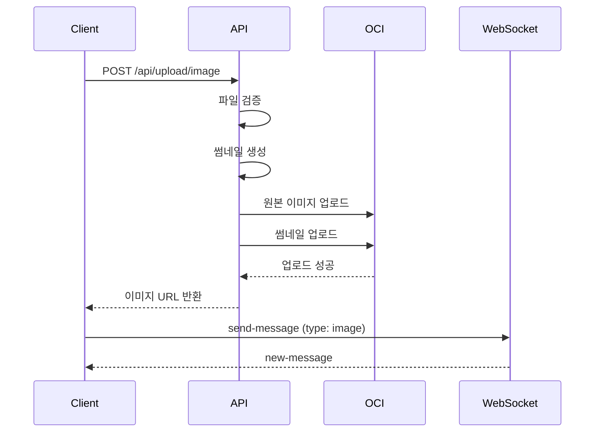

# 파일 업로드 (File Upload)

## 기능 개요

파일 업로드 기능은 사용자가 채팅방에 이미지를 업로드할 수 있게 합니다. Oracle Cloud Infrastructure (OCI) Object Storage를 사용하여 이미지를 저장합니다.

### 목적

- 이미지 메시지 전송
- 썸네일 자동 생성
- 안전한 파일 저장 및 관리

### 우선순위

**중간** - MVP 기능 (현재 구현 예정)

### 상태

🚧 **예정** - OCI Object Storage 연동 시 구현

---

## 전제 조건

### 파일 형식

- **지원 형식**: JPEG, PNG, GIF, WebP
- **최대 크기**: 5MB
- **권장 해상도**: 1920x1080 이하

### 인증

- 로그인 상태 (인증 필요)

### 저장소

- OCI Object Storage
- 버킷: `yeope-images`
- 네임스페이스: OCI 네임스페이스

---

## 기능별 상세 명세

### 1. 이미지 업로드

#### 기능 설명

사용자가 이미지 파일을 업로드하고, 업로드된 이미지의 URL을 받습니다.

#### API 명세

**엔드포인트**: `POST /api/upload/image`

**인증**: 필요 (Access Token)

**Content-Type**: `multipart/form-data`

**요청 헤더**:
```
Authorization: Bearer {access_token}
Content-Type: multipart/form-data
```

**요청 본문** (FormData):
- `image`: File (이미지 파일)
- `roomId`: String (선택, 방 ID)

**응답** (200 OK):
```json
{
  "imageUrl": "https://objectstorage.{region}.oraclecloud.com/n/{namespace}/b/yeope-images/o/images/{roomId}/{messageId}.jpg",
  "thumbnailUrl": "https://objectstorage.{region}.oraclecloud.com/n/{namespace}/b/yeope-images/o/images/{roomId}/{messageId}_thumb.jpg",
  "messageId": "770e8400-e29b-41d4-a716-446655440003"
}
```

#### 동작 방식

1. **인증 확인**
   - Access Token 검증

2. **파일 검증**
   - 파일 형식 검증 (JPEG, PNG, GIF, WebP)
   - 파일 크기 검증 (최대 5MB)
   - 이미지 유효성 검증

3. **이미지 처리**
   - 원본 이미지 저장
   - 썸네일 생성 (최대 300x300px)
   - 이미지 최적화 (선택)

4. **OCI Object Storage 업로드**
   - 경로: `images/{roomId}/{messageId}.jpg`
   - 썸네일 경로: `images/{roomId}/{messageId}_thumb.jpg`
   - 공개 읽기 권한 설정

5. **응답 반환**
   - 이미지 URL 및 썸네일 URL 반환

#### 예외 처리

| 에러 코드 | 상황 | 응답 메시지 |
|----------|------|------------|
| 401 | 인증 실패 | "인증이 필요합니다" |
| 400 | 파일 없음 | "이미지 파일을 선택해주세요" |
| 400 | 지원하지 않는 형식 | "지원하지 않는 이미지 형식입니다" |
| 400 | 파일 크기 초과 | "이미지 크기는 5MB 이하여야 합니다" |
| 500 | 업로드 실패 | "이미지 업로드에 실패했습니다" |

#### UI/UX 플로우

```
[채팅 화면]
  ↓
[이미지 선택 버튼 클릭]
  ↓
[갤러리/카메라 선택]
  ↓
[이미지 선택]
  ↓
[업로드 진행 표시]
  ↓
[성공] → [이미지 URL로 메시지 전송]
[실패] → [에러 메시지 표시]
```

---

### 2. 썸네일 생성

#### 기능 설명

업로드된 이미지의 썸네일을 자동으로 생성합니다.

#### 동작 방식

1. **이미지 리사이징**
   - 최대 크기: 300x300px
   - 비율 유지
   - 품질: 80%

2. **썸네일 저장**
   - 원본과 동일한 경로에 `_thumb` 접미사 추가
   - OCI Object Storage에 업로드

3. **URL 반환**
   - 썸네일 URL을 응답에 포함

---

### 3. 이미지 메시지 전송

#### 기능 설명

업로드된 이미지 URL을 사용하여 이미지 메시지를 전송합니다.

#### 동작 방식

1. **이미지 업로드**
   - 이미지 업로드 API 호출
   - 이미지 URL 및 썸네일 URL 받기

2. **메시지 전송**
   - WebSocket `send-message` 이벤트 사용
   - `type: "image"`
   - `imageUrl`: 업로드된 이미지 URL

#### 메시지 데이터

```json
{
  "roomId": "550e8400-e29b-41d4-a716-446655440000",
  "type": "image",
  "imageUrl": "https://objectstorage.../image.jpg"
}
```

---

## 시퀀스 다이어그램

### 이미지 업로드 및 메시지 전송 플로우



---

## 보안 고려사항

### 파일 검증

- 파일 형식 검증 (MIME 타입)
- 파일 크기 제한
- 이미지 유효성 검증 (실제 이미지 파일인지 확인)

### 접근 제어

- 공개 읽기 권한 (이미지 URL 접근 가능)
- 업로드는 인증된 사용자만 가능

### 저장 경로

- 사용자별 또는 방별로 경로 분리
- 예측 불가능한 파일명 사용 (UUID)

---

## 성능 고려사항

### 이미지 최적화

- 업로드 시 이미지 압축
- 썸네일 자동 생성
- WebP 형식 지원 (선택)

### CDN 연동 (향후)

- OCI Object Storage와 CDN 연동
- 이미지 로딩 속도 향상

---

## 데이터 모델

### 이미지 메시지

```typescript
interface ImageMessage {
  messageId: UUID;
  roomId: UUID;
  userId: UUID;
  type: 'image';
  imageUrl: string;        // 원본 이미지 URL
  thumbnailUrl?: string;   // 썸네일 URL (선택)
  createdAt: Timestamp;
}
```

---

## 참고 자료

- [기술 설계서 - 파일 업로드 API](../architecture/architecture.md#54-파일-업로드-api)
- [OCI Object Storage 문서](https://docs.oracle.com/en-us/iaas/Content/Object/Concepts/objectstorageoverview.htm)

