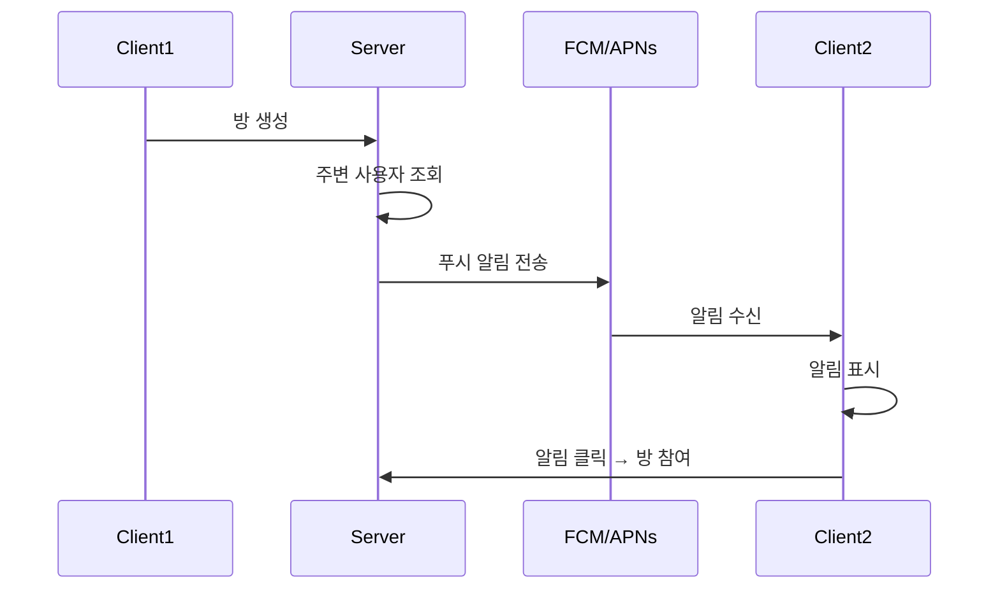

# 푸시 알림 (Push Notification)

## 기능 개요

푸시 알림 기능은 사용자에게 중요한 이벤트를 실시간으로 알립니다. Firebase Cloud Messaging (FCM)과 Apple Push Notification Service (APNs)를 사용합니다.

### 목적

- **메시지 알림**: 채팅 메시지 수신 시 알림 (앱이 백그라운드일 때)
- **주변 사용자 발견 알림**: BLE 탐색으로 주변에 YEO.PE 사용자가 나타났을 때 알림
- 방 생성 알림 (주변 사용자에게)
- 방 초대 알림

### 우선순위

**중간** - MVP 기능 (현재 구현 예정)

### 상태

🚧 **예정** - FCM/APNs 연동 시 구현

---

## 전제 조건

### 플랫폼별 요구사항

- **iOS**: APNs 인증서 또는 키 설정
- **Android**: FCM 서버 키 설정

### 권한

- **iOS**: 푸시 알림 권한 요청
- **Android**: FCM 토큰 자동 생성

### 설정

- Firebase 프로젝트 설정 (Android)
- Apple Developer 계정 설정 (iOS)

---

## 기능별 상세 명세

### 1. 디바이스 토큰 등록

#### 기능 설명

클라이언트의 FCM/APNs 토큰을 서버에 등록합니다.

#### API 명세

**엔드포인트**: `POST /api/push/register`

**인증**: 필요 (Access Token)

**요청 헤더**:
```
Authorization: Bearer {access_token}
```

**요청 본문**:
```json
{
  "deviceToken": "fcm_or_apns_token",
  "platform": "ios" | "android"
}
```

**응답** (200 OK):
```json
{
  "success": true,
  "message": "푸시 토큰이 등록되었습니다"
}
```

#### 동작 방식

1. **인증 확인**
   - Access Token 검증
   - 사용자 ID 추출

2. **토큰 저장**
   - PostgreSQL `push_tokens` 테이블에 저장
   - 사용자 ID와 매핑
   - 플랫폼 정보 저장 (ios/android)
   - 디바이스 정보 저장 (선택)
   - 같은 디바이스의 기존 토큰이 있으면 업데이트

3. **응답 반환**
   - 등록 성공 응답

#### 예외 처리

| 에러 코드 | 상황 | 응답 메시지 |
|----------|------|------------|
| 401 | 인증 실패 | "인증이 필요합니다" |
| 400 | 토큰 없음 | "디바이스 토큰이 필요합니다" |
| 400 | 플랫폼 오류 | "플랫폼은 'ios' 또는 'android'여야 합니다" |

---

### 2. 방 생성 알림

#### 기능 설명

사용자가 방을 생성했을 때 주변 사용자에게 알림을 전송합니다.

#### 동작 방식

1. **방 생성 감지**
   - 방 생성 API 호출 시 트리거

2. **주변 사용자 조회**
   - BLE 탐색 결과 기반으로 주변 사용자 조회
   - 또는 근처 활성 사용자 조회

3. **푸시 알림 전송**
   - 주변 사용자들에게 푸시 알림 전송
   - 방 정보 포함

#### 알림 데이터

```json
{
  "title": "새로운 방이 생성되었습니다",
  "body": "지하철 2호선",
  "data": {
    "type": "room_created",
    "roomId": "550e8400-e29b-41d4-a716-446655440000",
    "roomName": "지하철 2호선"
  }
}
```

---

### 3. 메시지 알림

#### 기능 설명

사용자가 채팅 메시지를 받았을 때 알림을 전송합니다. **앱이 백그라운드에 있거나 화면이 꺼져 있을 때만 전송**합니다.

#### 트리거 시점

- WebSocket으로 `new-message` 이벤트 수신 시
- 수신자가 WebSocket에 연결되어 있지 않거나, 연결되어 있어도 앱이 백그라운드 상태일 때

#### 동작 방식

1. **메시지 전송 감지**
   - `messageHandler.js`에서 메시지 저장 후
   - 같은 방의 모든 멤버에게 WebSocket 이벤트 전송
   - 동시에 푸시 알림 발송 서비스 호출

2. **수신자 확인**
   - 방 멤버 목록 조회
   - 발신자 제외
   - WebSocket 연결 상태 확인 (연결되어 있으면 푸시 발송 안 함)

3. **푸시 알림 전송**
   - 각 수신자의 푸시 토큰 조회
   - FCM을 통해 알림 전송
   - 메시지 발신자 정보 포함 (마스킹된 닉네임)

#### 알림 데이터

```json
{
  "notification": {
    "title": "김**",
    "body": "안녕하세요!"
  },
  "data": {
    "type": "new_message",
    "roomId": "550e8400-e29b-41d4-a716-446655440000",
    "roomName": "지하철 2호선",
    "messageId": "770e8400-e29b-41d4-a716-446655440003",
    "senderNicknameMask": "김**"
  }
}
```

#### 예외 처리

- 수신자가 푸시 알림을 비활성화한 경우: 발송 안 함
- 수신자가 WebSocket에 연결되어 있고 포그라운드 상태: 발송 안 함 (중복 방지)
- 만료된 푸시 토큰: 발송 실패 시 토큰 삭제

---

### 4. 주변 사용자 발견 알림

#### 기능 설명

BLE 탐색으로 주변에 YEO.PE 앱을 설치한 사용자가 나타났을 때 알림을 전송합니다.

#### 트리거 시점

- BLE 스캔 결과를 서버에 전송할 때 (`POST /api/users/ble/scan`)
- 이전 스캔 결과에 없던 새로운 사용자가 발견되었을 때

#### 동작 방식

1. **BLE 스캔 결과 수신**
   - 클라이언트가 `POST /api/users/ble/scan` 호출
   - 서버에서 UID 목록을 사용자 정보로 매칭

2. **새로운 사용자 감지**
   - 이전 스캔 결과와 비교 (Redis에 캐시)
   - 새로 발견된 사용자 식별

3. **푸시 알림 전송**
   - 발견된 사용자에게 알림 전송
   - "주변에 YEO.PE 사용자가 있습니다" 메시지

#### 알림 데이터

```json
{
  "notification": {
    "title": "주변에 사용자가 있습니다",
    "body": "근처에 YEO.PE 사용자가 나타났습니다"
  },
  "data": {
    "type": "nearby_user_found",
    "userCount": 2,
    "timestamp": 1234567890
  }
}
```

#### 예외 처리

- 사용자가 푸시 알림을 비활성화한 경우: 발송 안 함
- 너무 자주 알림이 오는 경우: 최소 간격 설정 (예: 5분)
- 같은 사용자에 대한 중복 알림 방지

---

### 5. 방 초대 알림

#### 기능 설명

BLE를 통해 방 초대를 받았을 때 알림을 전송합니다.

#### 동작 방식

1. **BLE 초대 감지**
   - BLE로 Room Invite 특성 변경 감지
   - 서버에 푸시 알림 요청

2. **푸시 알림 전송**
   - 초대자 정보 포함
   - 방 정보 포함

#### 알림 데이터

```json
{
  "title": "방 초대",
  "body": "김**님이 지하철 2호선 방에 초대했습니다",
  "data": {
    "type": "room_invite",
    "roomId": "550e8400-e29b-41d4-a716-446655440000",
    "roomName": "지하철 2호선",
    "inviterId": "660e8400-e29b-41d4-a716-446655440001"
  }
}
```

---

## 시퀀스 다이어그램

### 푸시 알림 전송 플로우



---

## 알림 타입

### new_message
새 메시지가 도착했을 때 전송되는 알림
- **우선순위**: 높음
- **발송 조건**: 앱이 백그라운드일 때만

### nearby_user_found
주변에 YEO.PE 사용자가 나타났을 때 전송되는 알림
- **우선순위**: 중간
- **발송 조건**: 새로운 사용자 발견 시, 최소 간격 5분

### room_created
방이 생성되었을 때 주변 사용자에게 전송되는 알림
- **우선순위**: 중간

### room_invite
방 초대를 받았을 때 전송되는 알림
- **우선순위**: 높음

### user_joined
사용자가 방에 참여했을 때 전송되는 알림 (선택)
- **우선순위**: 낮음

---

## 보안 고려사항

### 토큰 관리

- 토큰은 안전하게 저장
- 만료된 토큰 자동 삭제
- 사용자별 여러 디바이스 지원

### 알림 내용

- 민감한 정보는 알림에 포함하지 않음
- 마스킹된 닉네임만 사용

---

## 성능 고려사항

### 배치 전송

- 여러 사용자에게 동시에 알림 전송 시 배치 처리
- FCM/APNs의 배치 API 활용

### 알림 필터링

- 사용자가 알림을 받지 않도록 설정한 경우 필터링 (`settings.pushEnabled = false`)
- 앱이 포그라운드에 있을 때는 알림 전송하지 않음 (WebSocket 연결 확인)
- 중복 알림 방지 (같은 이벤트에 대한 짧은 시간 내 중복 발송 방지)

### 알림 발송 최소 간격

- **메시지 알림**: 제한 없음 (메시지마다 발송)
- **주변 사용자 발견**: 최소 5분 간격
- **방 생성 알림**: 최소 10분 간격

---

## 참고 자료

- [기술 설계서 - 푸시 알림 API](../architecture/architecture.md#56-푸시-알림-api)
- [Firebase Cloud Messaging 문서](https://firebase.google.com/docs/cloud-messaging)
- [Apple Push Notification Service 문서](https://developer.apple.com/documentation/usernotifications)

