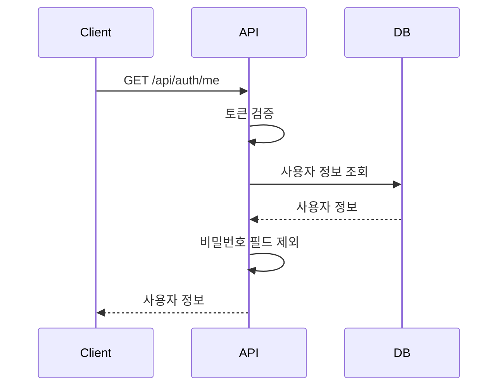

# 사용자 프로필 (User Profile)

## 기능 개요

사용자 프로필 기능은 현재 로그인한 사용자의 정보를 조회하고 수정할 수 있게 합니다.

### 목적

- 사용자 정보 조회
- 닉네임 수정
- 설정 변경 (향후 확장)

### 우선순위

**중간** - MVP 기능

---

## 전제 조건

### 사용자 정보 조회

- 로그인 상태 (인증 필요)

### 사용자 정보 수정

- 로그인 상태 (인증 필요)
- 본인 계정만 수정 가능

---

## 기능별 상세 명세

### 1. 사용자 정보 조회

#### 기능 설명

현재 로그인한 사용자의 프로필 정보를 조회합니다.

#### API 명세

**엔드포인트**: `GET /api/auth/me`

**인증**: 필요 (Access Token)

**요청 헤더**:
```
Authorization: Bearer {access_token}
```

**응답** (200 OK):
```json
{
  "user": {
    "id": "550e8400-e29b-41d4-a716-446655440000",
    "email": "user@example.com",
    "nickname": "사용자닉네임",
    "nicknameMask": "사용**",
    "settings": {
      "bleVisible": true,
      "pushEnabled": true
    },
    "createdAt": "2024-01-01T00:00:00.000Z",
    "lastLoginAt": "2024-01-02T00:00:00.000Z"
  }
}
```

#### 동작 방식

1. **인증 확인**
   - Access Token 검증
   - 사용자 ID 추출

2. **사용자 정보 조회**
   - 데이터베이스에서 사용자 정보 조회
   - 비밀번호 필드 제외

3. **응답 반환**
   - 사용자 정보 반환

#### 예외 처리

| 에러 코드 | 상황 | 응답 메시지 |
|----------|------|------------|
| 401 | 인증 실패 | "인증이 필요합니다" |
| 404 | 사용자 없음 | "사용자를 찾을 수 없습니다" |

#### UI/UX 플로우

```
[프로필 화면]
  ↓
[앱 시작 시 자동 로드]
  ↓
[사용자 정보 표시]
```

#### 테스트 케이스

**성공 시나리오**:
1. 유효한 Access Token으로 사용자 정보 조회
2. 정상적으로 사용자 정보 반환

**실패 시나리오**:
1. 토큰 없음 → 401 에러
2. 만료된 토큰 → 401 에러
3. 사용자가 존재하지 않음 → 404 에러

---

### 2. 사용자 정보 수정 (예정)

#### 기능 설명

사용자의 닉네임 및 설정을 수정합니다. (현재는 구현되지 않았으나 향후 확장 예정)

#### API 명세 (예정)

**엔드포인트**: `PATCH /api/users/me`

**인증**: 필요 (Access Token)

**요청 헤더**:
```
Authorization: Bearer {access_token}
```

**요청 본문**:
```json
{
  "nickname": "새닉네임",
  "settings": {
    "bleVisible": false,
    "pushEnabled": true
  }
}
```

**응답** (200 OK):
```json
{
  "user": {
    "id": "550e8400-e29b-41d4-a716-446655440000",
    "email": "user@example.com",
    "nickname": "새닉네임",
    "nicknameMask": "새**",
    "settings": {
      "bleVisible": false,
      "pushEnabled": true
    },
    "createdAt": "2024-01-01T00:00:00.000Z",
    "lastLoginAt": "2024-01-02T00:00:00.000Z"
  }
}
```

#### 동작 방식 (예정)

1. **인증 확인**
   - Access Token 검증
   - 사용자 ID 추출

2. **입력 검증**
   - 닉네임 길이 검증 (2-20자)
   - 설정 값 검증

3. **닉네임 마스킹 업데이트**
   - 새 닉네임으로 마스킹된 닉네임 재생성

4. **사용자 정보 업데이트**
   - 데이터베이스에 업데이트

5. **응답 반환**
   - 업데이트된 사용자 정보 반환

#### 예외 처리 (예정)

| 에러 코드 | 상황 | 응답 메시지 |
|----------|------|------------|
| 401 | 인증 실패 | "인증이 필요합니다" |
| 400 | 닉네임 길이 오류 | "닉네임은 2자 이상 20자 이하여야 합니다" |
| 404 | 사용자 없음 | "사용자를 찾을 수 없습니다" |

---

## 데이터 모델

### User 엔티티

```typescript
interface User {
  id: UUID;                    // 사용자 ID
  email: string;               // 이메일
  nickname: string;            // 닉네임
  nicknameMask: string;        // 마스킹된 닉네임
  settings: {                  // 설정
    bleVisible: boolean;       // BLE 탐색 가능 여부
    pushEnabled: boolean;      // 푸시 알림 활성화 여부
  };
  createdAt: Timestamp;        // 계정 생성 시간
  lastLoginAt: Timestamp;      // 마지막 로그인 시간
}
```

---

## 닉네임 마스킹 규칙

### 마스킹 알고리즘

1. **길이 0 또는 null**: `"*"`
2. **길이 1-2자**: 첫 글자 + `"*"`
3. **길이 3자 이상**: 첫 글자 + 나머지 모두 `"*"`

### 예시

- `"김철수"` → `"김**"`
- `"이영희"` → `"이**"`
- `"박"` → `"박*"`
- `"최"` → `"최*"`
- `""` → `"*"`

### 목적

- 사용자 프라이버시 보호
- 익명성 유지
- 다른 사용자에게는 마스킹된 닉네임만 표시

---

## 시퀀스 다이어그램

### 사용자 정보 조회 플로우



---

## 참고 자료

- [사용자 서비스](../server/src/services/userService.js)
- [인증 라우트](../server/src/routes/auth.js)
- [닉네임 마스킹 유틸](../server/src/utils/nickname.js)


