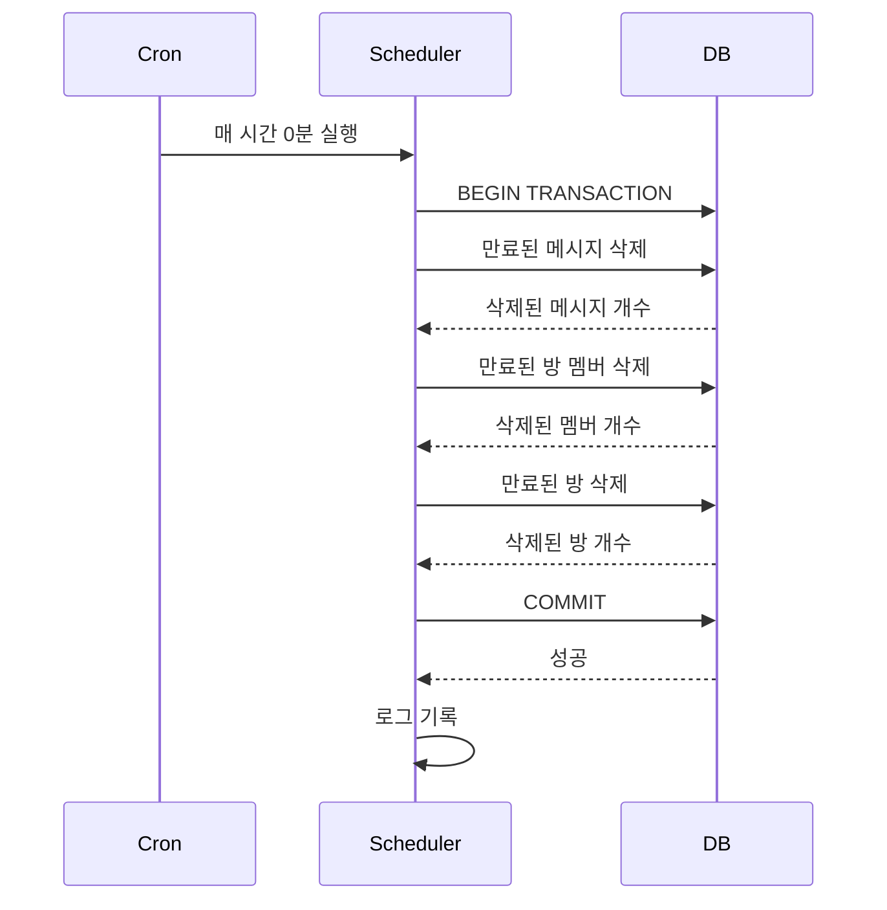
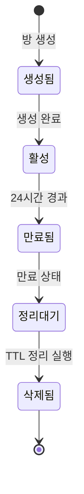
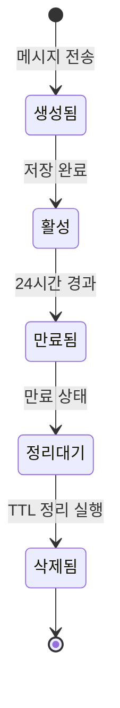

# TTL 자동 정리 (TTL Management)

## 기능 개요

TTL(Time To Live) 자동 정리 시스템은 만료된 방과 메시지를 주기적으로 삭제하여 데이터베이스의 무결성을 유지하고 저장 공간을 효율적으로 관리합니다.

### 목적

- 만료된 방 자동 삭제
- 만료된 메시지 자동 삭제
- 데이터베이스 정리 및 최적화
- 휘발성 서비스 정책 구현

### 우선순위

**높음** - MVP 핵심 기능

---

## 전제 조건

### TTL 정책

- **방 만료 시간**: 생성 시점부터 24시간
- **메시지 만료 시간**: 방과 동일하게 24시간
- **정리 주기**: 매 시간 0분 (예: 1:00, 2:00, 3:00...)

### 데이터베이스

- PostgreSQL 데이터베이스 연결
- 트랜잭션 지원

---

## 기능별 상세 명세

### 1. 만료된 데이터 정리

#### 기능 설명

만료된 방과 메시지를 데이터베이스에서 삭제합니다. 트랜잭션으로 안전하게 처리됩니다.

#### 동작 방식

1. **트랜잭션 시작**
   - 데이터베이스 트랜잭션 시작

2. **만료된 메시지 삭제**
   - `expires_at < NOW()`인 메시지 삭제
   - 삭제된 메시지 개수 로깅

3. **만료된 방의 멤버 삭제**
   - 만료된 방에 속한 모든 멤버 삭제
   - 삭제된 멤버 개수 로깅

4. **만료된 방 삭제**
   - `expires_at < NOW()`인 방 삭제
   - CASCADE로 관련 데이터 자동 삭제
   - 삭제된 방 개수 로깅

5. **트랜잭션 커밋**
   - 모든 작업이 성공하면 커밋
   - 오류 발생 시 롤백

#### 삭제 순서

중요: 외래 키 제약 조건을 고려하여 다음 순서로 삭제합니다:

1. 메시지 (rooms에 의존)
2. 방 멤버 (rooms에 의존)
3. 방 (최상위 엔티티)

#### 예외 처리

- **트랜잭션 롤백**: 오류 발생 시 모든 변경사항 롤백
- **로깅**: 모든 오류는 로그에 기록
- **재시도**: 다음 스케줄 실행 시 자동 재시도

---

### 2. TTL 정리 스케줄러

#### 기능 설명

Node.js cron을 사용하여 주기적으로 만료된 데이터를 정리합니다.

#### 스케줄 설정

**크론 표현식**: `0 * * * *`

**의미**: 매 시간 0분에 실행 (예: 1:00, 2:00, 3:00...)

#### 동작 방식

1. **서버 시작 시**
   - 스케줄러 자동 시작
   - 로그에 시작 메시지 기록

2. **스케줄 실행**
   - 매 시간 0분에 자동 실행
   - `cleanupExpiredData()` 함수 호출

3. **실행 결과 로깅**
   - 정리 시작/완료 로그
   - 삭제된 데이터 개수 로그
   - 오류 발생 시 에러 로그

#### 서버 재시작 시

- 서버가 재시작되어도 스케줄러는 자동으로 다시 시작됩니다.
- `src/index.js`에서 `startTTLScheduler()` 호출

---

## 데이터베이스 쿼리

### 만료된 메시지 삭제

```sql
DELETE FROM yeope_schema.messages 
WHERE expires_at < NOW() 
RETURNING id;
```

### 만료된 방의 멤버 삭제

```sql
DELETE FROM yeope_schema.room_members 
WHERE room_id IN (
  SELECT id FROM yeope_schema.rooms WHERE expires_at < NOW()
) 
RETURNING id;
```

### 만료된 방 삭제

```sql
DELETE FROM yeope_schema.rooms 
WHERE expires_at < NOW() 
RETURNING id;
```

**참고**: CASCADE 제약 조건으로 인해 방을 삭제하면 관련된 메시지와 멤버도 자동으로 삭제됩니다. 하지만 명시적으로 먼저 삭제하여 로깅을 정확하게 합니다.

---

## 시퀀스 다이어그램

### TTL 정리 플로우



---

## 상태 다이어그램

### 방 생명주기



### 메시지 생명주기



---

## 로깅

### 정상 실행 로그

```
[INFO] 만료된 데이터 정리 시작...
[INFO] 만료된 메시지 15개 삭제
[INFO] 만료된 방 멤버 8개 삭제
[INFO] 만료된 방 3개 삭제
[INFO] 만료된 데이터 정리 완료
```

### 오류 로그

```
[ERROR] 만료된 데이터 정리 중 오류: [에러 내용]
```

### 스케줄러 시작 로그

```
[INFO] TTL 정리 스케줄러 시작 (매 시간 실행)
```

---

## 성능 고려사항

### 인덱스 활용

다음 인덱스가 쿼리 성능을 향상시킵니다:

- `idx_rooms_expires_at`: 방 만료 시간 조회
- `idx_messages_expires_at`: 메시지 만료 시간 조회

### 트랜잭션 사용

- 모든 삭제 작업을 하나의 트랜잭션으로 처리
- 데이터 일관성 보장
- 오류 발생 시 롤백

### 실행 시간

- 정리 작업은 일반적으로 수 초 내에 완료됩니다.
- 데이터 양에 따라 실행 시간이 달라질 수 있습니다.

---

## 모니터링

### 확인 방법

1. **로그 확인**
   - 서버 로그에서 TTL 정리 실행 여부 확인
   - 삭제된 데이터 개수 확인

2. **데이터베이스 확인**
   - 만료된 방/메시지가 정상적으로 삭제되었는지 확인
   - `expires_at < NOW()`인 데이터가 없는지 확인

### 알림 (향후 확장)

- 정리 작업 실패 시 알림 발송
- 삭제된 데이터 개수가 비정상적으로 많을 경우 알림

---

## 테스트 케이스

### 성공 시나리오

1. **정상 정리**
   - 만료된 방과 메시지가 정상적으로 삭제됨
   - 로그에 삭제된 개수 정확히 기록됨

2. **만료된 데이터 없음**
   - 만료된 데이터가 없어도 정상 실행
   - 삭제된 개수 0으로 기록

### 실패 시나리오

1. **데이터베이스 연결 오류**
   - 트랜잭션 롤백
   - 에러 로그 기록
   - 다음 스케줄 실행 시 재시도

2. **트랜잭션 오류**
   - 모든 변경사항 롤백
   - 에러 로그 기록

---

## 참고 자료

- [TTL 서비스](../server/src/services/ttlService.js)
- [데이터베이스 스키마](../architecture/architecture.md#41-postgresql-스키마)
- [TTL 정리 SQL 함수](../server/database/ttl_cleanup.sql)

